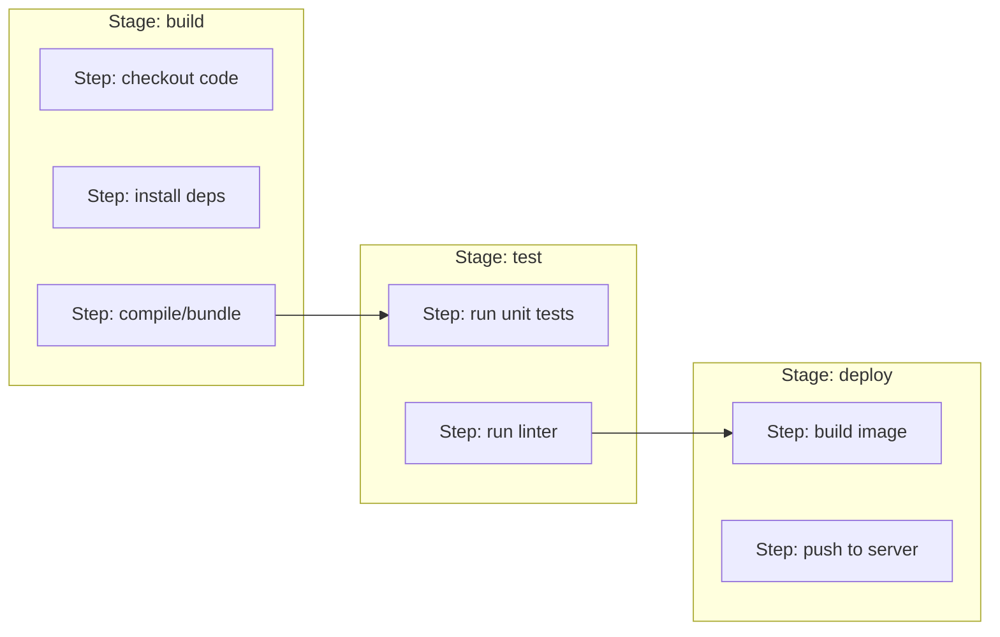

# The Pipeline Concept

A **pipeline** is the concrete, automated sequence of steps CI/CD tooling actually runs — usually
defined as a configuration file checked into the repository itself, so the pipeline's definition is
versioned right alongside the code it builds and tests.

## Pipeline as code

```yaml title="A minimal pipeline, in a GitHub-Actions-like syntax"
name: CI
on: [push]

jobs:
  build-and-test:
    runs-on: ubuntu-latest
    steps:
      - uses: actions/checkout@v4
      - run: npm install
      - run: npm run build
      - run: npm test
```

Defining the pipeline this way — as a file in the repo, not clicked together in some external
UI — means:

- **It's versioned** — a pipeline change is a normal commit/PR, reviewable the same way as any
  code change, with full history of who changed what and why.
- **It's reproducible** — anyone can read the exact steps that run, rather than trusting an
  external system's current (and possibly undocumented) configuration.
- **It travels with the code** — checking out an old commit gets you the pipeline that actually
  ran for that commit, not today's version.

## The vocabulary: stages, jobs, steps

Terminology varies slightly between platforms, but the concepts are consistent:

```text
Pipeline
 └─ Stage (or "job")     — a logical phase, e.g. "build," "test," "deploy"
     └─ Step               — one command or action within that stage
```



[Stages & Jobs](../04-pipeline-design/stages-and-jobs.md) covers how stages relate to each other
(sequential vs. parallel) in more depth.

## Pipeline runs are triggered, not always manual

A pipeline doesn't run continuously — it runs in response to specific **triggers** (a push, a
scheduled time, a manual button click). See
[Triggers & Events](./triggers-and-events.md) for the common trigger types and what each is
actually for.

## What a pipeline run actually produces

At minimum, a pass/fail result — but usually more:

- **Logs** — the full output of every step, essential for debugging a failure.
- **Artifacts** — files produced by the pipeline worth keeping (a built binary, a test coverage
  report) — see [Artifacts](../02-build-and-test/artifacts.md).
- **Status checks** — a visible pass/fail signal, often blocking a PR from merging until it's
  green.

## Reading a pipeline's status

```bash
# conceptually, regardless of platform:
✅ build-and-test    2m 14s
✅ lint                 34s
❌ deploy                — failed at step "push to server"
```

A failed pipeline should be diagnosable from its logs alone in the large majority of cases — a
pipeline whose failures routinely require guessing or reproducing locally to understand is usually
a sign the pipeline itself needs better logging or clearer step separation.
