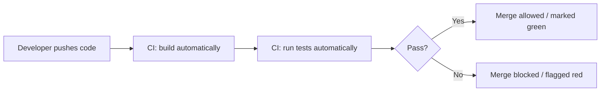
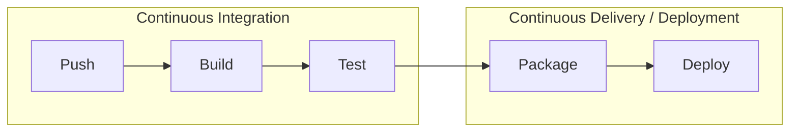

# What Is CI/CD

**CI/CD** is shorthand for two related but distinct practices: **Continuous Integration** and
**Continuous Delivery** (or **Deployment**) — automating the path from a code change to that
change running somewhere real, with humans reviewing outcomes rather than manually performing
every step.

## Continuous Integration (CI)

The practice of merging code changes into a shared branch **frequently** (multiple times a day,
ideally), with an automated process verifying each change immediately — building it, running
tests, checking for obvious problems.

The core idea predates any specific tool: catch integration problems (two people's changes
conflicting, a change breaking something else) **quickly**, while the context is fresh, instead of
discovering it weeks later when a large batch of changes gets combined all at once.

## Continuous Delivery vs. Continuous Deployment

Both extend CI one step further — automating what happens *after* tests pass — but they stop at
different points:

- **Continuous Delivery** — every change that passes CI is automatically prepared to be released
  (built, packaged, ready to ship) but a **human explicitly decides** when to actually deploy it.
- **Continuous Deployment** — every change that passes CI is **automatically deployed** to
  production, with no manual approval step at all.

The distinction is covered in depth in
[Continuous Delivery vs. Deployment](../03-deployment-strategies/continuous-delivery-vs-deployment.md)
— it's a genuinely common point of confusion, since both are commonly (and loosely) called "CD."

## The full picture

"CI/CD pipeline" refers to this whole automated chain — see
[The Pipeline Concept](./the-pipeline-concept.md) for what a pipeline actually is as a concrete
artifact (usually a YAML config file), not just an abstract idea.

## Why this matters beyond "automation is nice"

- **Faster feedback** — a broken build or failing test is caught in minutes, not discovered by a
  teammate pulling broken code hours or days later.
- **Lower-risk releases** — deploying small, frequent changes is safer than deploying a huge batch
  of accumulated changes at once, because if something breaks, there's a much smaller set of
  recent changes to suspect.
- **Removes manual, error-prone steps** — a human running the same 8-step deploy checklist
  eventually fat-fingers a step; a pipeline runs the same steps identically every single time.

## A note on scope for this topic

This topic covers CI/CD as a general practice and set of concepts — the ideas apply regardless of
which specific tool runs them (GitHub Actions, GitLab CI, Jenkins, CircleCI, and others all
implement the same underlying concepts differently). See
[Tools & Platforms](../06-tools-and-platforms/github-actions-basics.md) for where a specific
platform is covered concretely.
