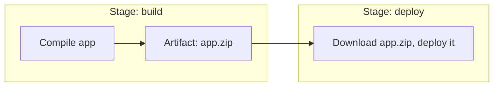

# Artifacts

An **artifact** is a file (or set of files) a pipeline produces that's worth keeping around after
the run finishes — a built binary, a compiled bundle, a test report, a container image.

## Why artifacts exist as a concept

Each stage of a pipeline typically runs in its own **fresh, isolated environment** (see
[Stages & Jobs](../04-pipeline-design/stages-and-jobs.md)) — nothing from the build stage is
automatically available in the deploy stage unless it's explicitly passed along. Artifacts are
that explicit hand-off mechanism.



## Uploading and downloading

```yaml
jobs:
  build:
    steps:
      - run: npm run build
      - uses: actions/upload-artifact@v4
        with:
          name: dist
          path: dist/

  deploy:
    needs: build
    steps:
      - uses: actions/download-artifact@v4
        with:
          name: dist
          path: dist/
      - run: ./deploy.sh dist/
```

The `build` and `deploy` jobs here could even run on entirely different machines — the artifact
mechanism is what bridges that gap, rather than assuming shared filesystem state between stages.

## Common things treated as artifacts

```text
- A compiled binary or bundled frontend build
- A container image (though often handled via a registry push instead — see the Docker topic's
  Building & Tagging Images)
- Test result reports (see Running Tests in CI)
- Code coverage reports
- Generated documentation
- Build logs, for anything not captured in the standard log output
```

## Artifact retention

```yaml
- uses: actions/upload-artifact@v4
  with:
    name: dist
    path: dist/
    retention-days: 7
```

Artifacts aren't kept forever by default on most platforms — a retention period balances "keep it
long enough to be useful for debugging a recent issue" against unbounded storage growth. A
short-lived build artifact (used only to hand off between stages of the same run) typically needs
far less retention than a release artifact meant to be downloadable later.

## Artifacts vs. a registry/package repository

For anything meant to be versioned, discoverable, and reused across many separate pipeline runs
(a Docker image, an npm package), a proper registry is usually the better fit than a pipeline's own
artifact storage:

```text
Pipeline artifact:   short-lived, scoped to one pipeline run, mainly for handing off between
                       stages of that same run
Registry/package:      long-lived, versioned, independently pullable/installable by anything,
                          not just the pipeline that produced it
```

[Building & Tagging Images](/study-materials/docker/images-and-dockerfiles/building-and-tagging-images)
in the Docker topic covers exactly this distinction for container images specifically — pushed to
a registry (Docker Hub, GHCR), not just uploaded as a pipeline artifact.
