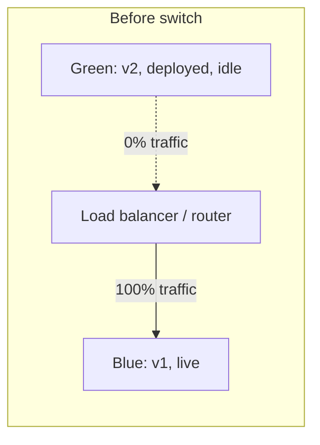
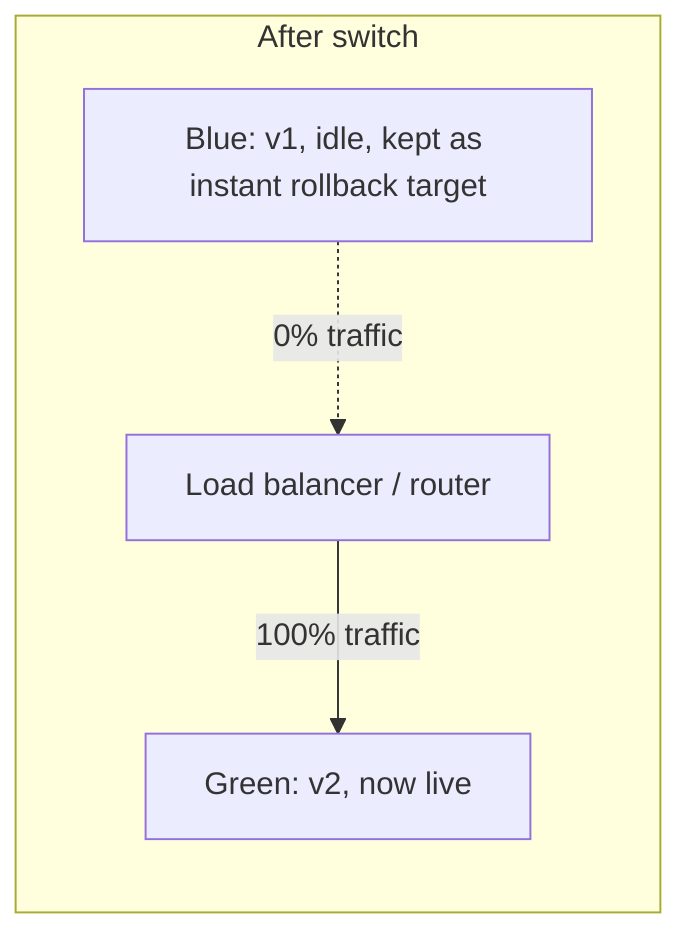
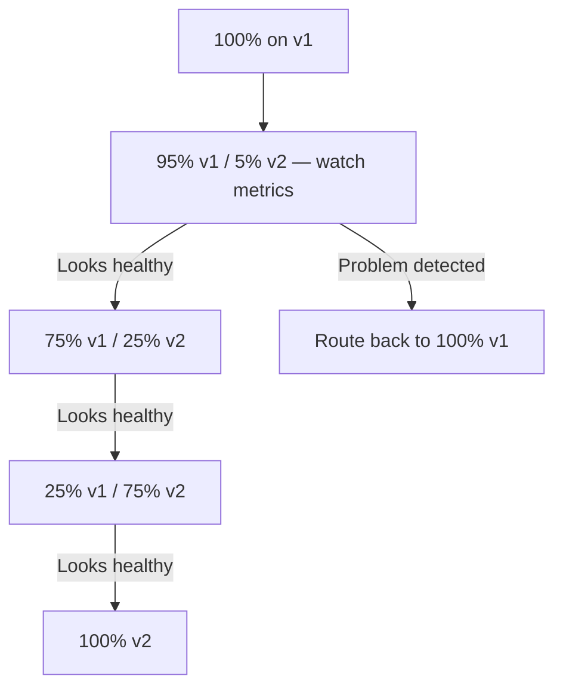

# Blue-Green & Canary Deployments

Two different strategies for **how** a new version actually replaces the old one in production —
both aimed at the same goal (avoid a hard, risky cutover), via genuinely different mechanisms.

## Blue-green deployment

Run **two complete, identical production environments** — "blue" (currently live) and "green"
(the new version) — and switch traffic from one to the other all at once, at the routing layer.

- **The switch is instant** — one routing change flips all traffic from blue to green.
- **Rollback is equally instant** — if green has a problem, flip the router back to blue, which
  never stopped running.
- **Cost**: requires running two full production environments simultaneously, at least during the
  transition — meaningfully more infrastructure than a single environment.

## Canary deployment

Route a **small percentage** of real traffic to the new version first, watch for problems, then
gradually increase that percentage until it reaches 100% — named after the historical practice of
using canaries to detect danger before it reached miners.

- **Exposure is gradual and limited** — a genuine problem in the new version affects a small
  fraction of users first, not everyone at once.
- **Requires real traffic-splitting infrastructure** — a load balancer or service mesh capable of
  routing a precise percentage of requests to each version, plus monitoring sensitive enough to
  actually detect a problem in that small canary slice before rolling further.
- **Slower** — reaching 100% rollout takes deliberate time, by design, unlike blue-green's instant
  switch.

## Side by side

| | Blue-Green | Canary |
|---|---|---|
| Traffic shift | All at once | Gradual, percentage-based |
| Infrastructure cost | Two full environments | Traffic-splitting capability, not necessarily 2x infra |
| Rollback speed | Instant (flip back) | Fast, but a canary already affected some real users |
| Detects problems before... | Full traffic switch (binary: works or doesn't) | Reaching 100% of users (graduated exposure) |
| Complexity | Simpler routing, more infra | More complex routing/monitoring, less infra duplication |

## Neither replaces good rollback capability

Both strategies reduce risk during the *rollout* itself, but neither substitutes for a solid plan
for what happens when a problem is caught — see [Rollbacks](./rollbacks.md) for that piece
specifically, which applies regardless of which rollout strategy got you there.
