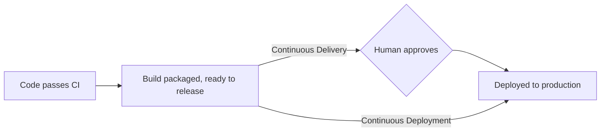

# Continuous Delivery vs. Deployment

[What Is CI/CD](../01-basics/what-is-ci-cd.md) introduced this distinction briefly — this page
goes deeper, because the two terms get used interchangeably far more often than the underlying
practices actually match.

## The one real difference: who pulls the trigger



- **Continuous Delivery** — every change that passes CI is automatically built and made
  release-ready, but a person explicitly clicks "deploy." The automation stops one step short of
  production.
- **Continuous Deployment** — that same change goes straight to production with no manual gate at
  all, the moment it passes CI.

Both are commonly (and loosely) shortened to "CD" — the letter doesn't tell you which one a team
means, which is exactly why this distinction trips people up in conversation.

## Why a team would choose delivery over deployment

- **Regulatory or compliance requirements** — some industries require a documented human sign-off
  before production changes, making full continuous deployment a non-starter regardless of
  technical readiness.
- **Coordinated releases** — a change that needs to ship alongside a marketing announcement, a
  mobile app store review, or another team's dependent change benefits from a deliberate release
  moment rather than shipping the instant it's ready.
- **Confidence-building** — a team newer to automated deployment often starts with delivery (build
  automation, manual deploy button) and graduates to full deployment once trust in the pipeline's
  test coverage is established.

## Why a team would choose full deployment

- **Speed** — the entire point of removing the manual gate: a fix or feature reaches users in
  minutes, not whenever someone next remembers to click deploy.
- **Removes a human bottleneck** — a required manual approval that becomes a routine rubber-stamp
  provides little real safety while still slowing every release down.
- **Forces genuinely strong automated testing** — a team can't responsibly deploy every passing
  commit straight to production without trusting their test suite completely, which pushes real
  investment into test quality rather than leaning on manual review as a safety net.

## Feature flags — decoupling deploy from release

A technique that makes full continuous deployment far less risky: ship code to production behind
a **feature flag**, disabled by default, so *deploying* the code and *releasing* the feature to
users become two separate, independently-controllable events.

```text
1. Deploy new feature, flag OFF        — code is live in production, but inert/invisible
2. Enable flag for internal team only   — verify in production with real infrastructure
3. Enable flag for 5% of users            — canary-style gradual rollout (see Blue-Green & Canary)
4. Enable flag for everyone                 — full release, no new deploy needed
```

This means a bad deploy and a bad *feature* become separable problems — reverting a broken
feature is flipping a flag (instant), not necessarily rolling back a whole deploy (see
[Rollbacks](./rollbacks.md)).

## Neither is strictly "more mature" than the other

Continuous deployment is often presented as the aspirational end state, but continuous delivery
with a deliberate human gate is a completely legitimate, permanent choice for many teams and
contexts — the right answer depends on what's actually being shipped and who's affected by getting
it wrong, not a maturity ladder every team should climb.
