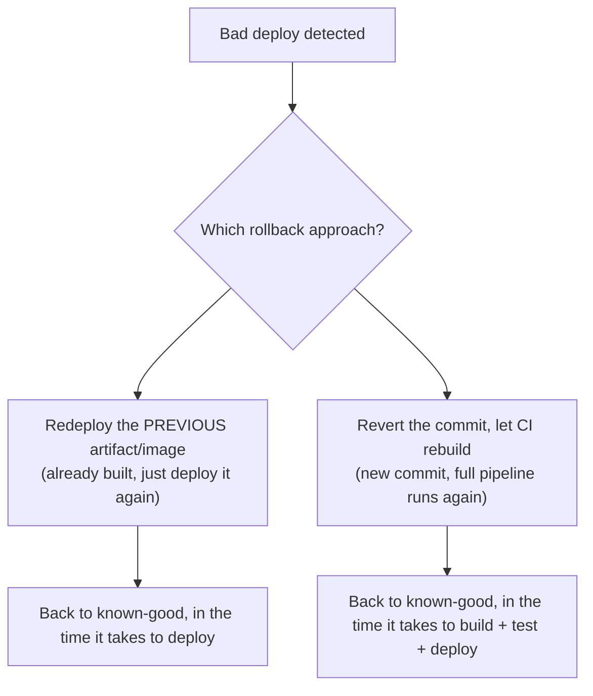

# Rollbacks

However careful the rollout strategy (see
[Blue-Green & Canary](./blue-green-and-canary.md)), something eventually ships broken. A
**rollback** is how a team gets back to a known-good state quickly — and the fastest correct
option isn't always the first one that comes to mind.

## Two fundamentally different approaches

- **Redeploy a previous artifact** — if the previous version's build output (a container image
  tag, a compiled binary) still exists somewhere, deploying it again is often the fastest path
  back — no rebuild, no re-running the test suite, just re-running the deploy step against
  already-verified output.
- **Revert the commit and let CI rebuild** — `git revert` the bad commit (see
  [Undoing Changes](/study-materials/git/history-and-fixes/undoing-changes) in the Git topic),
  push, and let the full pipeline run again from scratch. Cleaner from a version-history
  standpoint, but slower — the entire build-test-deploy cycle runs again.

## Why "just revert the commit" isn't always fast enough

During an active incident, the difference between these two approaches can be minutes vs. tens of
minutes — a full CI pipeline (build, test suite, deploy) might take 10-20 minutes to complete
again, time that matters a great deal when production is actively broken for real users. This is
the practical argument for keeping recent build artifacts/image tags readily deployable (see
[Artifacts](../02-build-and-test/artifacts.md)) rather than relying solely on "revert and rebuild"
as the only rollback path.

:::note
The two approaches aren't mutually exclusive — a common real pattern: redeploy the previous
artifact **immediately** to stop the bleeding, then separately revert the bad commit in git so the
history stays honest and the next regular deploy doesn't accidentally reintroduce the same bug.
:::

## What makes a rollback actually fast

- **Immutable, tagged artifacts** — if every build produces a uniquely tagged, retained artifact
  (see [Building & Tagging Images](/study-materials/docker/images-and-dockerfiles/building-and-tagging-images)
  in the Docker topic for exactly this pattern with container images), "deploy the previous one"
  is a simple, well-understood operation, not an improvised one under pressure.
- **A deploy process that's already automated** — if deploying requires the same pipeline
  machinery either direction, rolling back is just "deploy, but point at an older version" rather
  than a special, rarely-exercised procedure.
- **Database/schema changes need their own plan** — a rollback that only reverts application code
  but leaves an incompatible database migration in place can make things *worse*, not better. This
  is why backward-compatible migrations (a new column, not renaming/dropping one, until the old
  code path is fully retired) are a deliberate practice specifically to keep rollbacks safe.

## Rollback capability should be exercised, not just assumed

A rollback procedure that's never actually been run before the moment it's urgently needed is a
real risk in itself — the same principle as testing a backup by actually restoring from it, not
just trusting the backup job "probably" works.
