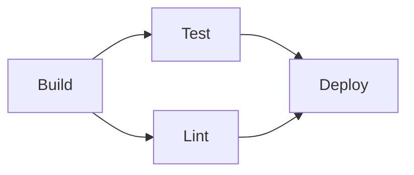
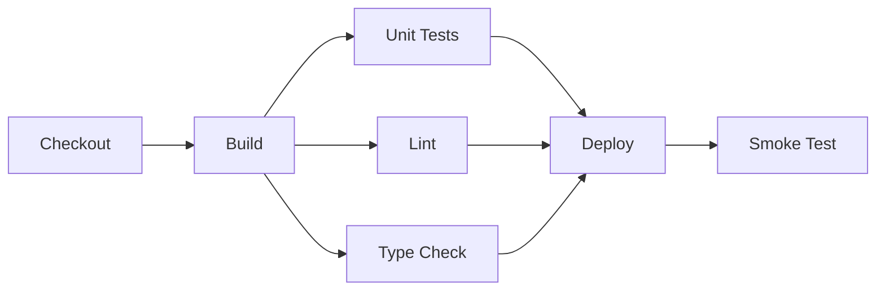

# Stages & Jobs

[The Pipeline Concept](../01-basics/the-pipeline-concept.md) introduced stages and jobs briefly —
this page covers how they actually relate to each other: what runs in order, what can run at the
same time, and why that shape matters.

## Sequential by default, parallel by choice

Without explicit configuration, most CI platforms run jobs sequentially — each waiting for the
previous to finish. Declaring independence between jobs is what unlocks running them in parallel
instead.

```yaml
jobs:
  build:
    steps: [...]

  test:
    needs: build      # waits for build to finish
    steps: [...]

  lint:
    needs: build        # ALSO waits for build, but doesn't depend on test
    steps: [...]

  deploy:
    needs: [test, lint]   # waits for BOTH test and lint to finish
    steps: [...]
```



`test` and `lint` both depend only on `build`, not on each other — so once `build` finishes, they
run **simultaneously**, and `deploy` waits for both to complete. This shape (one fan-out, one
fan-in) is extremely common: a single build feeding multiple independent verification steps that
all have to pass before deploying.

## Why declare dependencies explicitly instead of just listing jobs in order

A CI platform doesn't run jobs in the order they're written in a file — it builds the actual
dependency graph from `needs:` (or the platform's equivalent) and schedules jobs accordingly.
Two jobs with no dependency relationship between them run in parallel automatically, without
needing to explicitly ask for parallelism — see
[Parallelization](./parallelization.md) for more on deliberately exploiting this.

## What runs inside one job vs. across jobs

```yaml
jobs:
  build:
    steps:
      - run: npm install     # step 1
      - run: npm run build     # step 2, same job, same environment, runs after step 1
```

Steps within one job run **sequentially, in one shared environment** (same filesystem, same
installed dependencies from earlier steps). Separate jobs, by contrast, typically run in **fresh,
isolated environments** — nothing installed in `build`'s environment is automatically available in
`test`'s, unless explicitly passed along (see [Artifacts](../02-build-and-test/artifacts.md) for
that hand-off mechanism).

## A realistic multi-stage shape



Fanning out multiple independent, fast checks (tests, lint, type-checking) right after a single
build, then fanning back in before deploy, is a common pattern precisely because it minimizes
total pipeline time — the slowest single check determines how long that fan-out phase takes, not
the sum of all of them.

## When to keep things in one job vs. split into many

Splitting too finely adds overhead (each job typically pays its own environment-setup cost —
checking out code, installing dependencies again) that can outweigh the parallelism benefit for
genuinely fast steps. A useful rule of thumb: split into separate jobs when steps are slow enough,
or independent enough, that running them concurrently meaningfully shortens the pipeline — not
purely for organizational tidiness.
