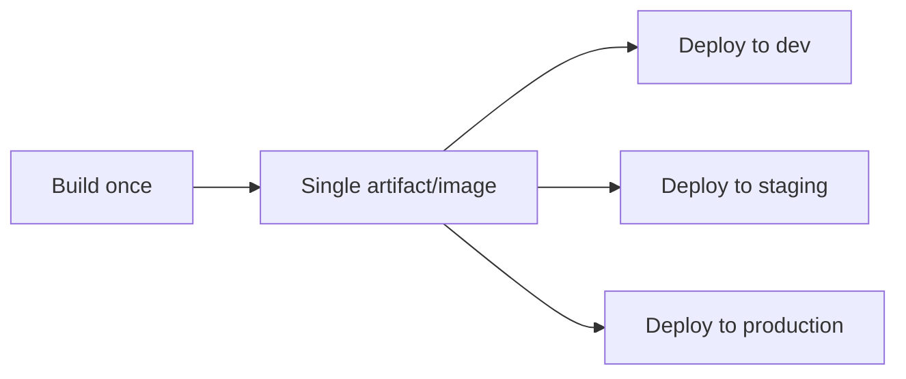

# Environment Promotion

Most real deployment setups don't go straight from "code merged" to "running in front of every
user" — a build typically moves through a sequence of **environments**, each one a closer
approximation of production, gaining confidence at each step.

## The typical chain


- **Development** — a shared or per-developer environment, often deployed automatically and
  frequently, used for early integration testing. Lowest stakes if something's broken.
- **Staging** (sometimes called pre-production) — configured to closely mirror production (similar
  infrastructure, production-like data volume/shape), the last checkpoint before real users are
  affected.
- **Production** — real users, real consequences. Highest stakes, and typically the environment
  with the most deliberate gating before a deploy reaches it.

## The same build artifact, promoted — not rebuilt per environment



A meaningful principle: build **once**, then promote that exact same artifact through each
environment, rather than rebuilding separately for each one. Rebuilding per environment
reintroduces the very risk CI is meant to eliminate — the possibility that what's tested in
staging isn't bit-for-bit identical to what actually deploys to production (a different dependency
resolution, a different compiler version, anything non-deterministic in the build). See
[Automated Builds](../02-build-and-test/automated-builds.md) for why build determinism matters,
and [Artifacts](../02-build-and-test/artifacts.md) for the mechanism that makes "build once,
deploy everywhere" practical.

## Environment-specific configuration

```yaml title="Conceptual: same artifact, different config per environment"
# staging
DATABASE_URL: postgres://staging-db/app
LOG_LEVEL: debug

# production
DATABASE_URL: postgres://prod-db/app
LOG_LEVEL: warn
```

What differs between environments should be **configuration**, injected at deploy/runtime — not a
different build. This is the same environment-variable mechanism covered in
[Managing Secrets in CI](./managing-secrets-in-ci.md), just applied per-environment: staging and
production typically have entirely separate secret values (a staging database credential should
never grant access to the production database).

## Manual approval gates on production specifically

```yaml title="Conceptual"
jobs:
  deploy-staging:
    steps: [...]        # runs automatically

  deploy-production:
    needs: deploy-staging
    environment:
      name: production
      # platform-specific: require manual approval before this job proceeds
    steps: [...]
```

A common, deliberate middle ground between full continuous deployment and fully manual releases
(see [Continuous Delivery vs. Deployment](../03-deployment-strategies/continuous-delivery-vs-deployment.md)):
automatically deploy to every environment up through staging, but require an explicit human
approval specifically for the production step — verification happens automatically, the
consequential decision stays human.

## Why staging needs to genuinely resemble production

A staging environment that diverges significantly from production (different data volume,
different infrastructure sizing, missing integrations) only catches a subset of the problems
production would actually reveal — "it worked in staging" provides real confidence only in
proportion to how faithfully staging actually mirrors what's ahead of it in the chain.
