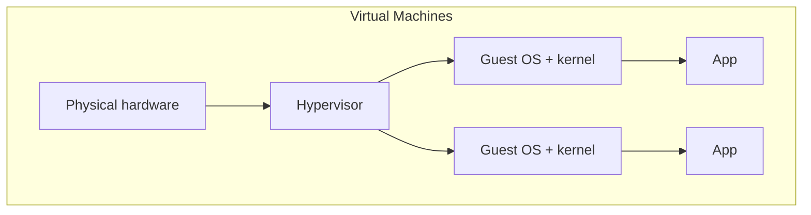
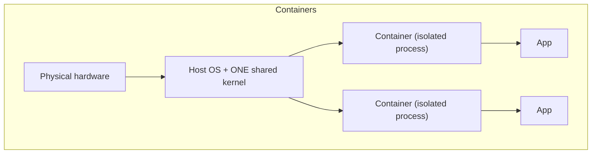

# Containers vs. VMs

Both let you run isolated workloads on shared hardware — but at fundamentally different layers,
with real consequences for speed, density, and what kind of isolation you actually get.

## The core difference

A VM virtualizes hardware and runs a **complete, separate operating system** (its own kernel) on
top. A container shares the **host's own kernel** (see
[What Is a Container](./what-is-a-container.md) for the namespaces/cgroups mechanism behind that)
— there's no second kernel booting at all.

## What that difference actually costs and buys

| | Virtual Machine | Container |
|---|---|---|
| Startup time | Seconds to minutes (booting a real OS) | Milliseconds to a couple seconds |
| Overhead per instance | A full OS's worth of RAM/disk | Just the app + its own filesystem layer |
| Isolation strength | Very strong — separate kernel, hardware-enforced | Weaker — shares the host kernel; a kernel-level exploit can affect containers differently than it would VMs |
| Density (instances per host) | Lower — each one is a full OS | Much higher — thousands of lightweight containers is realistic |
| Can run a different OS *kernel* than the host | Yes (e.g. Windows VM on a Linux host) | No — a Linux container needs a Linux host kernel |

## The isolation tradeoff, honestly

VMs give stronger isolation because the hypervisor boundary is enforced by hardware virtualization
features, largely independent of the guest OS's own security. A container's isolation is enforced
by the host kernel itself (namespaces, cgroups) — genuinely good in practice, and hardened further
by tools most container runtimes use by default (seccomp, capabilities dropping), but a kernel
vulnerability is a more direct path to breaking container isolation than it typically is for
breaking out of a VM.

:::note
This is a real security consideration, not just a performance footnote — it's part of why
multi-tenant cloud platforms running genuinely untrusted workloads from different customers often
still reach for VM-level isolation (or a hybrid like Firecracker microVMs), while containers are
the default choice for isolating your *own* trusted services from each other.
:::

## Why containers won for typical app deployment

For running your own application's services (a web app, a database, a background worker) —
workloads you trust, that don't need to run a different kernel — the speed and density of
containers is a clear win over VMs, without meaningfully weakening isolation for that use case.
This is exactly why this org's own sites run as Docker containers rather than separate VMs per
site (see
[This Org's Container Setup](../06-production-practices/this-orgs-container-setup.md)) — multiple
isolated services on one VPS, without the overhead of booting a full OS per site.
