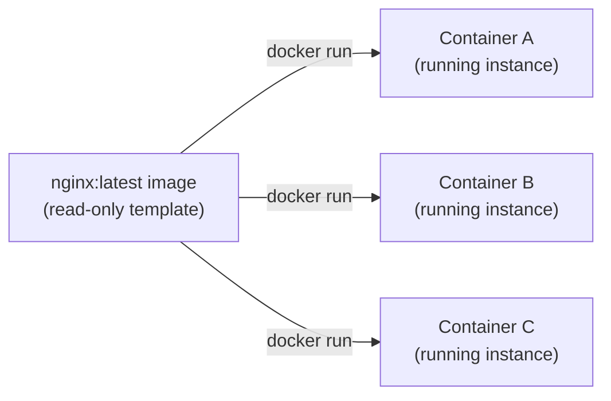
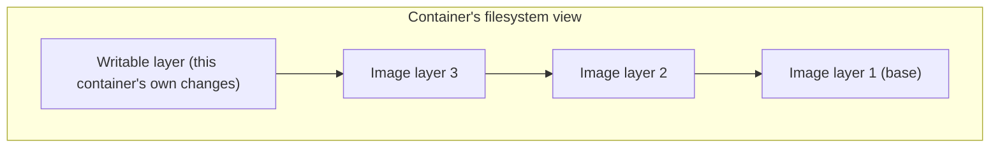

# Images vs. Containers

The single most important distinction to have straight before anything else in this topic makes
sense.

## The class/instance analogy

An **image** is a read-only template — a filesystem snapshot plus metadata (what command to run,
what ports it expects, environment defaults). A **container** is a running (or stopped) *instance*
created from an image, with its own writable layer on top.



The same image can spawn any number of independent containers — exactly like a class can be
instantiated many times, each instance with its own state, but sharing the same underlying
definition.

## Seeing this directly

```bash
docker images                # list images on this machine — the templates
docker ps -a                   # list containers — every instance ever created from them, running or not
```

```bash
docker run --name web1 -d nginx
docker run --name web2 -d nginx
docker ps
# web1 and web2 — two separate containers, both from the same nginx image
```

## What changes between them

- **Images are immutable** — you never "edit" an image directly; you build a *new* image from a
  Dockerfile (see [Dockerfile Basics](../02-images-and-dockerfiles/dockerfile-basics.md)).
- **Containers are ephemeral by default** — any file a container writes while running lives only
  in that container's own writable layer. Delete the container (`docker rm`), and that layer is
  gone — the image it came from is completely unaffected. This is exactly why
  [Data Persistence](../04-networking-and-storage/data-persistence.md) needs volumes for anything
  that must survive a container being recreated.

## A container's writable layer



Everything below the writable layer is shared, read-only, and identical across every container
made from that image — this is why starting a new container is nearly instant (nothing to copy,
just a new thin writable layer added on top) while a VM boot is comparatively slow (an entire OS
has to actually start). [Image Layers & Caching](../02-images-and-dockerfiles/image-layers-and-caching.md)
covers exactly how those read-only layers are built and reused.

## Rebuilding vs. restarting — a common point of confusion

```bash
docker restart web1        # same container, same writable layer, just stopped/started again
docker rm web1 && docker run --name web1 -d nginx    # brand new container, fresh writable layer, nginx's own data reset
```

`restart` preserves anything the container wrote to its own layer; removing and re-running from
the image does not — a subtlety that matters a lot once a container is actually holding state
(see [Volumes & Bind Mounts](../04-networking-and-storage/volumes-and-bind-mounts.md) for the
right way to avoid depending on that layer for anything important).
