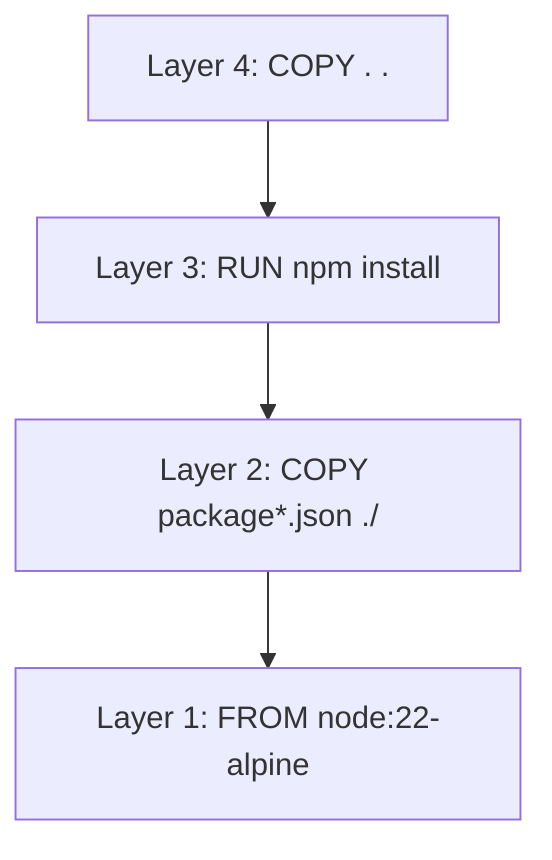
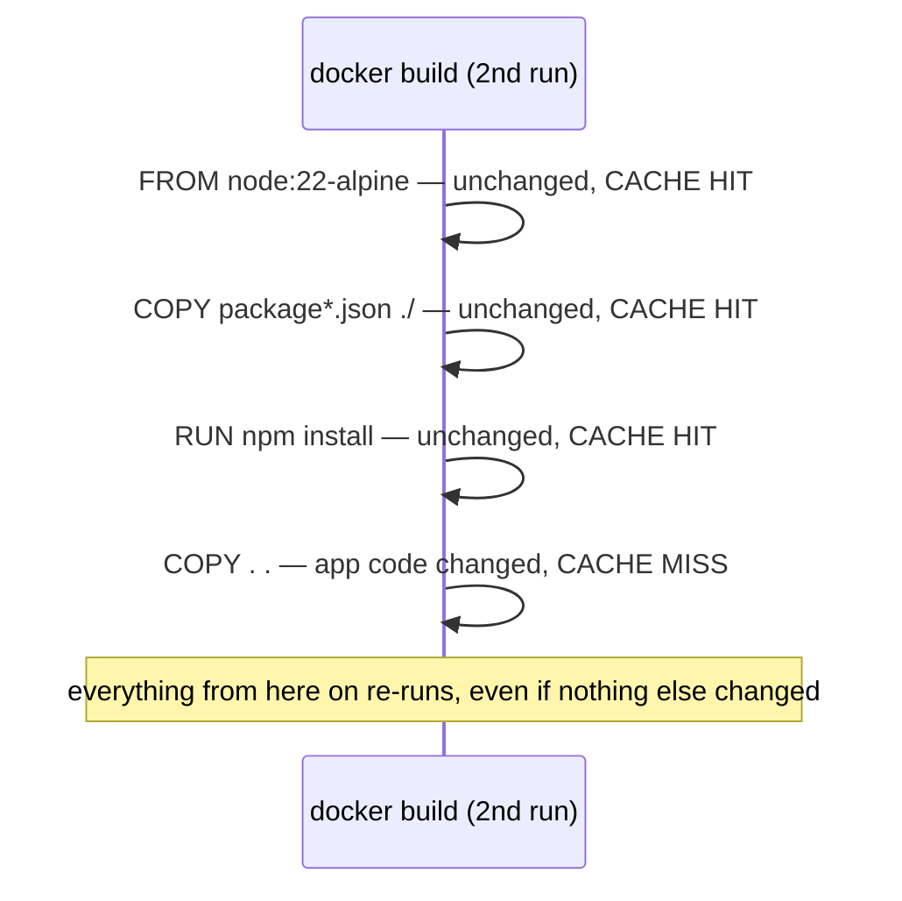

# Image Layers & Caching

Every instruction in a Dockerfile that changes the filesystem (`FROM`, `RUN`, `COPY`, `ADD`)
produces a new, **immutable layer** stacked on top of the previous one. Understanding this is what
makes Dockerfile instruction order a real performance decision, not just style.

## Layers, visually



Each layer only stores the *diff* from the layer below it — `docker history` (see
[Building & Tagging Images](./building-and-tagging-images.md)) shows exactly what each layer added
and how large it is.

## The build cache

Docker caches each layer, keyed on its instruction **and** its inputs. On a rebuild, if a layer's
instruction and inputs are unchanged, Docker reuses the cached layer instead of re-executing it —
and critically, **every layer after the first changed one is invalidated too**, even if those
later instructions themselves didn't change.



This is exactly *why* [Dockerfile Basics](./dockerfile-basics.md) recommends copying
`package.json` and running `npm install` **before** copying the rest of the app — application
code changes far more often than dependencies do, so keeping the expensive, rarely-changing
`npm install` step early means it stays cached across most rebuilds.

## A concrete before/after

```dockerfile title="❌ Cache-unfriendly order"
FROM node:22-alpine
WORKDIR /app
COPY . .              # ANY file change invalidates everything below this line
RUN npm install          # re-runs on every single code change, even a one-line CSS tweak
CMD ["node", "server.js"]
```

```dockerfile title="✅ Cache-friendly order"
FROM node:22-alpine
WORKDIR /app
COPY package*.json ./     # only invalidated when dependencies actually change
RUN npm install
COPY . .                    # app code changes land here, npm install stays cached
CMD ["node", "server.js"]
```

Same final image, dramatically different rebuild speed in normal day-to-day development.

## Forcing a clean rebuild

```bash
docker build --no-cache -t my-app:latest .
```

Useful when you suspect a stale cached layer is masking a real problem (e.g. a base image was
updated upstream, but the cached layer doesn't know that) — normal development shouldn't need
this regularly, since the caching is meant to be transparent and correct.

## Multi-stage builds — reusing this same mechanism deliberately

Layer caching is also the foundation of multi-stage builds (see
[Dockerfile Best Practices](../06-production-practices/dockerfile-best-practices.md)) — building
in one stage, then copying only the needed *output* into a slimmer final stage, discarding the
build tools' own layers entirely from the final image.
