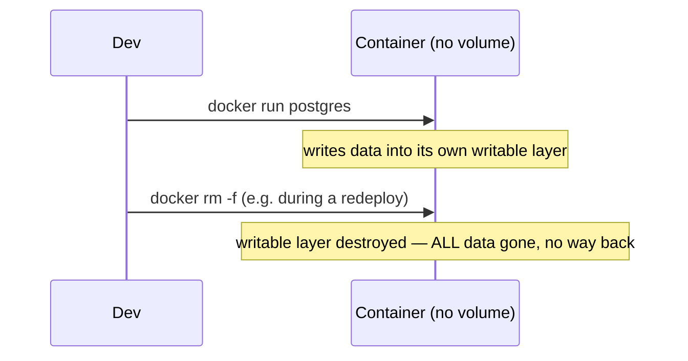
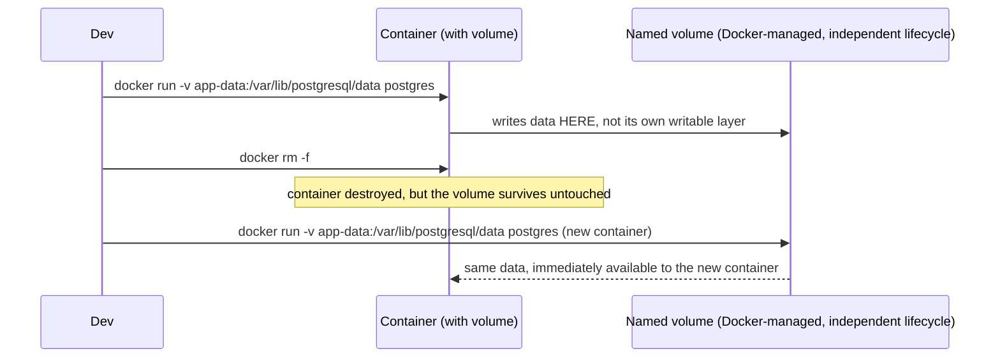

# Data Persistence

Ties together [Images vs. Containers](../01-basics/images-vs-containers.md) and
[Volumes & Bind Mounts](./volumes-and-bind-mounts.md) into the one rule that actually matters in
practice: **never rely on a container's own writable layer for anything you need to keep.**

## Why containers are ephemeral by default

A container's writable layer (see
[Images vs. Containers](../01-basics/images-vs-containers.md)) exists only as long as that
specific container does. Removing it — deliberately with `docker rm`, or as part of a routine
redeploy that recreates the container from a new image — discards that layer entirely, with no
warning and no undo.



This is by design, not a bug — it's exactly what makes containers cheap to recreate, tear down,
and redeploy without accumulating cruft. The cost is that anything meant to *persist* has to be
explicitly told to live somewhere else.

## The fix: mount a volume for anything that must survive



The data's lifecycle becomes independent of any *specific* container — the volume can outlive many
container recreations, exactly as a redeploy is expected to work.

## What actually needs a volume

```text
Needs a volume:
  - A database's data directory (postgres, mysql, redis with persistence enabled)
  - User-uploaded files, if stored on disk rather than an external object store
  - Any application state that must survive a redeploy

Doesn't need one:
  - A stateless web server or API — anything it "writes" (logs, temp files) should go to
    stdout/stderr (see Exec, Logs & Inspect) or be genuinely disposable
  - Build artifacts produced fresh on every image build
```

A genuinely stateless service is *supposed* to lose everything in its writable layer on
restart/redeploy — that's a feature, not something to work around. The moment a service needs data
to survive being recreated, that's the signal it needs a volume, not that containers are somehow
"unreliable" for storage.

## A common real-world mistake

```bash
❌ docker run postgres        # no volume — every redeploy silently wipes the entire database
✅ docker run -v pg-data:/var/lib/postgresql/data postgres
```

This exact mistake — forgetting the volume on a database container — is one of the most common,
and most painful, Docker mistakes: everything works fine in testing (the container just never
happened to get removed), until the first real redeploy quietly destroys production data with no
error at all, because from Docker's perspective nothing went wrong — it did exactly what `docker
rm` asks it to do.
