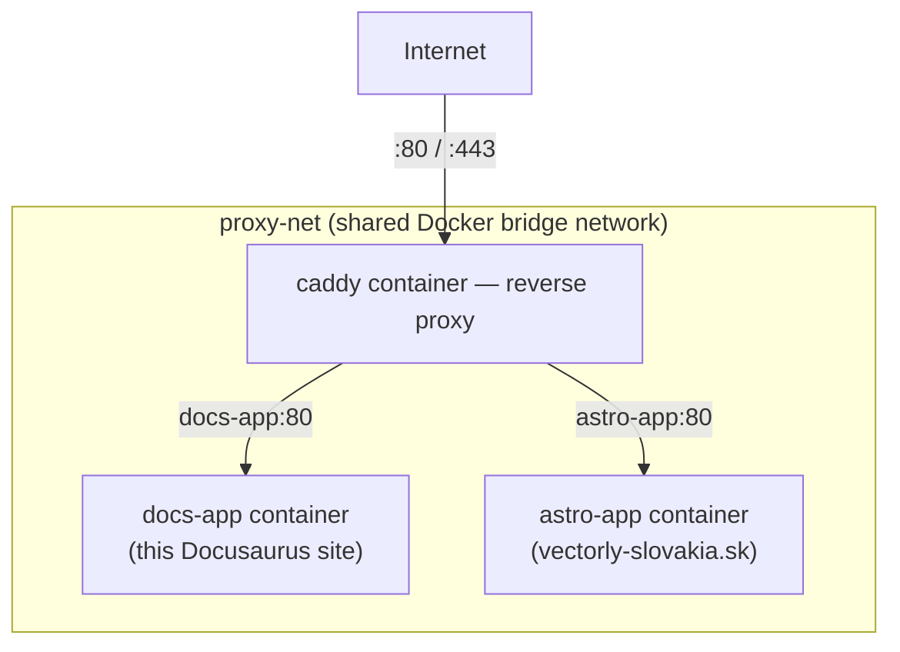

# Compose in This Org's Deploy

Everything in this Docker Compose section, applied to a real deploy pipeline — see
[`/internal-operations/server-architecture`](/internal-operations/server-architecture) and
[`/internal-operations/git-workflow`](/internal-operations/git-workflow) for the full source of
truth this page summarizes.

## The actual deploy command

Both this docs site and the main marketing site are deployed with the same core step:

```bash
docker compose up -d --build
```

— exactly the [rebuild command](./compose-basics.md#rebuilding-after-a-code-change) covered
earlier in this section, run by a GitHub Actions workflow over SSH after it connects to the VPS
(see [SSH Basics](/study-materials/networking/ssh/ssh-basics) in the Networking topic for how
that connection itself works).

## The shape of the real setup



Each site is its **own** Compose project, in its own deploy directory
(`/opt/vectorly-docs`, `/opt/vectorly-main-site`) with its own `docker-compose.yml` and its own
GitHub Actions workflow — not one giant Compose file for everything. They share the same external
`proxy-net` network (declared `external: true` — see
[Docker Networking Basics](/study-materials/networking/practical-setups/docker-networking-basics)
in the Networking topic for exactly what that means and why), which is what lets Caddy reach both
`docs-app` and `astro-app` by name despite them being entirely separate Compose projects, deployed
independently.

## Why separate Compose projects instead of one shared file

- Each site deploys **independently** — a push to `vectorly-docs` triggers only that site's
  workflow and only rebuilds `docs-app`, without touching or restarting the unrelated
  `astro-app` container.
- Each has its **own build pipeline and Node version** appropriate to that specific site, not a
  one-size-fits-all shared image definition.
- A mistake in one site's Compose file can't accidentally break the other's deployment.

## What each site's `docker-compose.yml` roughly does

```yaml title="Conceptual shape of this docs site's docker-compose.yml"
services:
  docs-app:
    build: .
    networks:
      - proxy-net
    # no `ports:` published directly — only reachable via Caddy on proxy-net,
    # see Ports & Network Modes for what publishing vs. not publishing actually means

networks:
  proxy-net:
    external: true
```

No `ports:` mapping at all is the deliberate detail here — `docs-app` is never meant to be reached
directly from the internet, only through Caddy. This is the concrete, real-world instance of the
[Ports & Network Modes](../04-networking-and-storage/ports-and-network-modes.md) principle that a
container's port is only reachable by other containers on its network by default, unless
explicitly published.

## Tying the whole Docker topic together

This one deploy — `git push` → CI → `docker compose up -d --build` → Caddy routes by hostname —
touches nearly everything covered earlier in this topic: an image built from a
[Dockerfile](../02-images-and-dockerfiles/dockerfile-basics.md), a
[container lifecycle](../03-running-containers/container-lifecycle.md) managed by Compose, and
[networking](../04-networking-and-storage/ports-and-network-modes.md) that deliberately keeps the
app container unreachable except through the reverse proxy.
