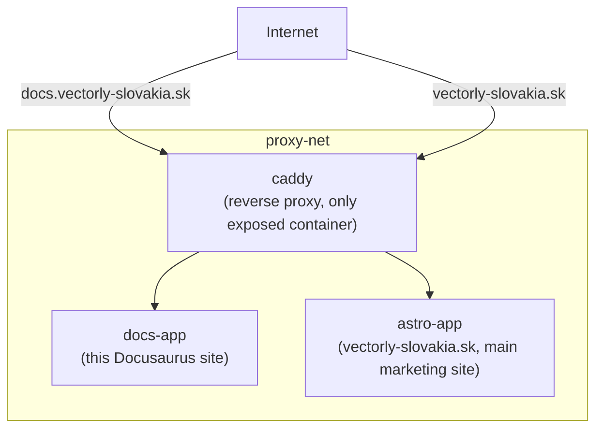
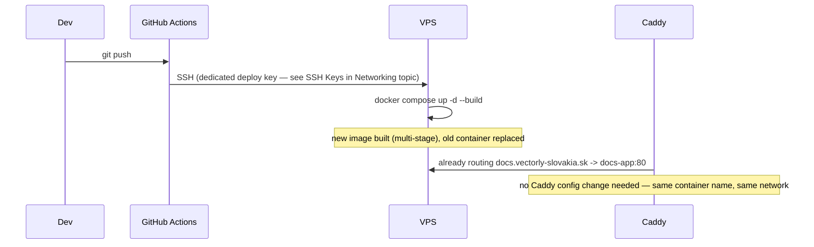

# This Org's Container Setup

A concrete, end-to-end walkthrough of how everything in this Docker topic comes together in this
org's actual production setup — see
[`/internal-operations/server-architecture`](/internal-operations/server-architecture) for the
authoritative source; this page is the guided tour through it, in the order this topic covered the
concepts.

## The infrastructure, at a glance

- **Hosting**: a single Netcup VPS (Linux, Docker) — see
  [Containers vs. VMs](../01-basics/containers-vs-vms.md) for why multiple isolated sites share one
  VPS via containers rather than needing one VM each.
- **Server user**: a dedicated non-root user (`bnovak`), not root — see
  [Sudo & Root](/study-materials/linux-shell/permissions-and-users/sudo-and-root) in the Linux &
  Shell topic for why that's the standard practice this follows.
- **Network**: every public-facing service is an isolated container attached to a shared external
  Docker bridge network, `proxy-net` — see
  [Ports & Network Modes](../04-networking-and-storage/ports-and-network-modes.md) for what
  "bridge network" actually means, and
  [Docker Networking Basics](/study-materials/networking/practical-setups/docker-networking-basics)
  in the Networking topic for the deeper mechanics of this specific setup.
- **Reverse proxy**: a Caddy container is the single entry point for all incoming web traffic,
  handling TLS automatically and routing by hostname — see
  [Reverse Proxies](/study-materials/networking/web-serving/reverse-proxies) in the Networking
  topic.

## Two sites, two independent deployments

| | Docs portal (this site) | Main site |
|---|---|---|
| Deploy directory | `/opt/vectorly-docs` | `/opt/vectorly-main-site` |
| Stack | Docusaurus + Node.js 22 builder → Nginx (Alpine) runner | Astro (SSG) + Node.js 22 builder → Nginx (Alpine) runner |
| Container name | `docs-app` | `astro-app` |
| Deploy trigger | Push to `main` | Push to `develop` |
| Extra security | Caddy HTTP Basic Auth (bcrypt) | — |

Both follow the same pattern covered in
[Dockerfile Best Practices](./dockerfile-best-practices.md): a multi-stage build (a Node.js builder
stage, producing static output served by a minimal Nginx runner stage) — the built site is what
actually ships in the final image, not the Node.js build toolchain itself.

## The deploy sequence, tying every earlier page together

The reverse proxy configuration doesn't need to change on every deploy — it routes to a **container
name** (`docs-app:80`) on the shared network, not a specific container instance, so
`docker compose up -d --build` replacing the container underneath is invisible to Caddy's routing
rule. This is exactly the payoff of the [Compose](../05-docker-compose/compose-in-this-orgs-deploy.md)
+ [named networking](../04-networking-and-storage/ports-and-network-modes.md) approach covered
earlier in this topic, applied concretely.

## Why no `ports:` are published on either app container

Neither `docs-app` nor `astro-app` publishes a port to the host directly (see
[Ports & Network Modes](../04-networking-and-storage/ports-and-network-modes.md)) — only Caddy
does. This means the app containers are simply **unreachable** from the internet except through
Caddy, by construction, not by a firewall rule that could be misconfigured — one of the concrete,
practical payoffs of understanding container networking rather than just running `docker run -p`
on every service out of habit.
