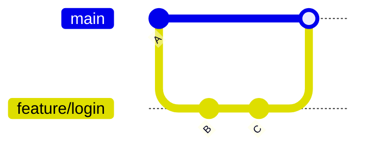
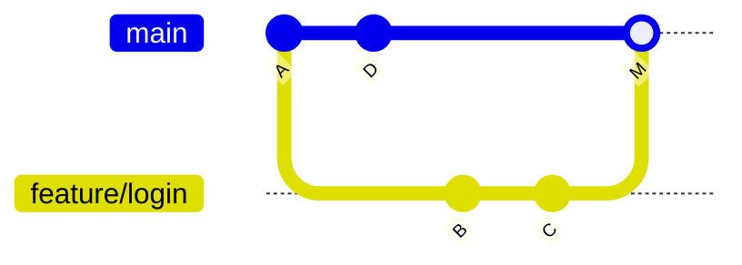

# Merging

Merging brings the changes from one branch into another.

```bash
git switch main
git merge feature/login
```

This merges `feature/login` **into** whatever branch you currently have checked out (`main` here).

## Fast-forward merge

If `main` hasn't moved since `feature/login` branched off it, Git doesn't need to create a merge
commit at all — it just slides the `main` pointer forward to `feature/login`'s latest commit:



This is a **fast-forward** — `main` just slides forward to `C`, no separate merge commit. History
stays linear, nothing to merge.

## Three-way merge

If `main` *has* moved (someone else pushed commits) while `feature/login` was being worked on, Git
creates a **merge commit** — a commit with two parents that combines both histories:



`M` is the new merge commit — it has two parents, `D` and `C`. Git compares the two branch tips against their common ancestor (`A`) — a "three-way" comparison —
and auto-merges anything that only changed on one side.

## Merge conflicts

A conflict happens when **both** branches changed the *same lines* of the *same file* differently.
Git can't guess which version you want, so it stops and marks the file:

```text title="file.txt after a conflicting merge"
<<<<<<< HEAD
const timeout = 30;
=======
const timeout = 60;
>>>>>>> feature/login
```

- Everything between `<<<<<<< HEAD` and `=======` is **your current branch's** version.
- Everything between `=======` and `>>>>>>> feature/login` is the **incoming branch's** version.

To resolve: edit the file by hand to what it *should* say, delete the `<<<<<<<`/`=======`/`>>>>>>>`
markers, then:

```bash
git add file.txt          # mark this file as resolved
git commit                 # completes the merge (message is pre-filled)
```

Abort out entirely if it's a mess and you want to start over:

```bash
git merge --abort
```

## Merge vs. rebase

Merge preserves exactly what happened (including a merge commit); rebase rewrites history to look
linear. See [Rebasing](./rebasing.md) for the tradeoff, and
[Squash & Rebase](../05-conventions/squash-and-rebase.md) for which one we actually use here.

## Check yourself

- When does Git perform a fast-forward merge instead of creating a merge commit?

  <details>
  <summary>Answer</summary>

  When the target branch (e.g. `main`) hasn't moved since the branch being merged diverged from
  it — Git just slides the pointer forward, no merge commit needed.
  </details>

- In a merge conflict, which branch's version appears between `<<<<<<< HEAD` and `=======`?

  <details>
  <summary>Answer</summary>

  Your current branch's version — the incoming branch's version is between `=======` and
  `>>>>>>> <branch>`.
  </details>

- What creates a merge commit's "two parents"?

  <details>
  <summary>Answer</summary>

  A three-way merge — Git compares both branch tips against their common ancestor and creates a
  commit combining both histories, with each original branch tip as a parent.
  </details>
