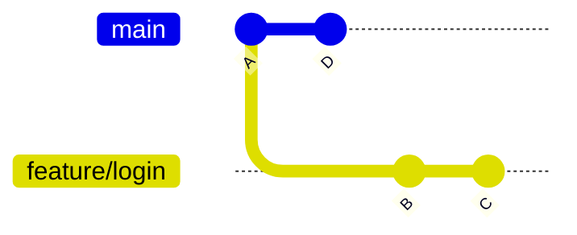
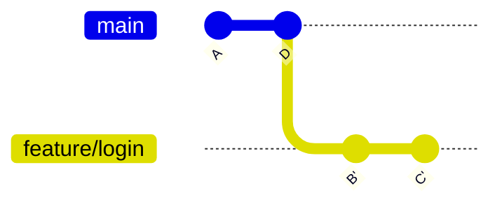

# Rebasing

Rebasing takes the commits on your branch and replays them on top of a different starting point —
usually the latest `main`.

```bash
git switch feature/login
git rebase main
```

## What it does, visually

Before:



After `git rebase main`:



`B` and `C` become `B'` and `C'` — same *content*, new commit hashes, because their parent changed.
Your branch now looks like it was written starting from `D`, even though it wasn't. History reads
as one straight line instead of the diverging/converging shape a merge produces.

## Rebase vs. merge

|  | Merge | Rebase |
|---|---|---|
| History shape | Preserves what actually happened, including a merge commit | Rewrites to look linear |
| Commit hashes | Unchanged | Rewritten (new hashes) for every replayed commit |
| Safe on shared branches? | Yes, always | **No** — rewriting commits others already pulled causes divergent history for them |
| Good for | Merging a finished feature into `main` | Cleaning up / updating your own in-progress branch before it's shared |

**Rule of thumb: never rebase a branch other people are also working on.** Rebasing rewrites
commit hashes; if someone already pulled the old ones, their history and yours no longer match.
Rebase freely on a private feature branch only you are touching.

## Interactive rebase

`rebase -i` lets you edit, reorder, combine, or drop commits before they're replayed:

```bash
git rebase -i HEAD~3      # interactively rewrite the last 3 commits
```

Opens an editor with a list like:

```text
pick a1b2c3d Add login form
pick e4f5g6h Fix typo
pick h7i8j9k Add validation
```

Change `pick` to:
- `reword` — keep the commit, edit its message
- `squash` (or `s`) — combine into the *previous* commit, keep both messages to edit
- `fixup` (or `f`) — combine into the previous commit, **discard** this message
- `drop` — remove the commit entirely

Example — squashing a "fix typo" commit into the one before it:

```text
pick a1b2c3d Add login form
fixup e4f5g6h Fix typo
pick h7i8j9k Add validation
```

Result: two clean commits instead of three messy ones. This is the mechanism behind
[Squash & Rebase](../05-conventions/squash-and-rebase.md) — cleaning up locally before a PR is
merged.

## If a rebase conflicts

Same conflict markers as a merge (see [Merging](./merging.md)). Fix the file, then:

```bash
git add file.txt
git rebase --continue      # not `git commit` — rebase handles that itself
```

Or bail out entirely:

```bash
git rebase --abort
```
