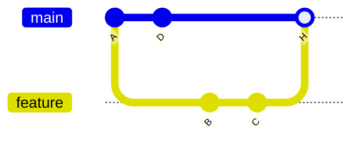
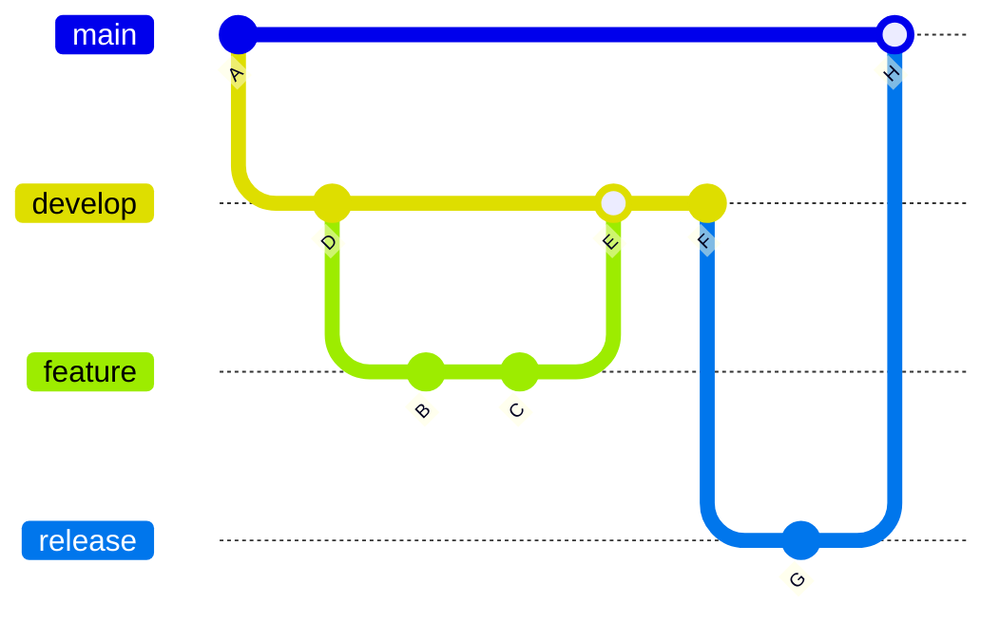

# Git Workflow Models

A "workflow model" is just a team's agreed convention for how branches get created, named, and
merged. Git itself doesn't enforce any of these — they're process, not tooling.

## Feature-branch workflow

Every piece of work gets its own short-lived branch off `main`, merged back via PR once done.

Simple, works well for small-to-medium teams, and is what most PR-based tools (GitHub, GitLab)
are built around.

## Trunk-based development

Similar in spirit, but pushes for **very** short-lived branches (often merged same-day) or even
committing straight to `main` behind feature flags, to avoid long-running branches drifting far
from each other. Favored by teams doing continuous deployment.

## GitFlow

A heavier model with dedicated long-lived branches: `main` (production), `develop` (integration),
plus `feature/*`, `release/*`, and `hotfix/*` branches, each with defined rules for where they
merge to/from.

Gives strong structure for products with scheduled releases and multiple versions in the wild
simultaneously (e.g. shipped desktop software). Overkill for a continuously-deployed web app —
more ceremony than most small teams need.

## Tradeoffs at a glance

| Model | Branch lifetime | Best for |
|---|---|---|
| Feature-branch | Days | Most PR-based team projects |
| Trunk-based | Hours | Continuous deployment, high commit velocity |
| GitFlow | Weeks+ | Scheduled releases, multiple maintained versions |

## What we actually do here

See [`/internal-operations/git-workflow`](/internal-operations/git-workflow) for this
organization's real policy — a lightweight `main` + `develop` + `feature/*` model (closest to
GitFlow above, minus `release/*`/`hotfix/*`), squash-merged, with a docs-only fast path straight
to `main`. Treat this page as the general theory, that page as the binding practice.
