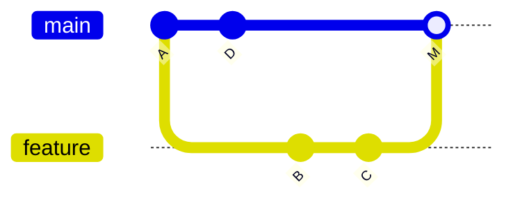

# Squash & Rebase

**This is the merge strategy used in this org's repos** — see
[`/internal-operations/git-workflow`](/internal-operations/git-workflow) for the binding policy;
this page explains the mechanics and reasoning behind it.

## Three ways to bring a branch into `main`

**Merge commit** — keeps every individual commit from the branch, plus a merge commit tying them
together:



**Rebase merge** — replays the branch's commits on top of `main` first, then fast-forwards (no
merge commit at all), but still keeps every individual commit:

```
main:     A---D---B'---C'
```

**Squash merge** (what we use) — takes *all* commits on the branch and collapses them into a
**single** commit on `main`, regardless of how many messy commits existed on the branch:

```
main:     A---D---S      (S = one commit containing everything from B and C combined)
```

## Why squash here

- `main`/`develop` history stays **one meaningful commit per feature/fix** — no `wip`, `fix typo`,
  `test again` clutter permanently in history (see
  [Commit Hygiene](./commit-hygiene.md)).
- Each commit on `main` corresponds to exactly one PR, which makes `git log`, `git bisect`
  (see [Bisect](../04-history-and-fixes/bisect.md)), and changelogs far easier to read.
- The messy in-progress commits still exist in the PR's history on the feature branch/GitHub —
  nothing is lost, just not carried onto `main`.

## The actual local steps

```bash
# 1. branch from develop
git checkout develop
git pull origin develop
git checkout -b feature/neo4j-notes

# 2. commit normally as you work (messy is fine locally)
git add .
git commit -m "feat(study): add advanced graph indexing notes"

# 3. before pushing/opening the PR: rebase onto latest develop, squash your own commits
git fetch origin develop
git rebase -i origin/develop
#   in the editor: keep the first commit as `pick`, mark the rest `squash` (or `fixup`)

# 4. push (force needed, since rebase rewrote your branch's commits)
git push origin feature/neo4j-notes --force-with-lease
```

Then open the PR and use the platform's **"Squash and merge"** button — this does the final
squash into one commit on `develop`/`main` at merge time, even if you skipped step 3.

## `--force-with-lease`, not `--force`

Rebasing rewrites commit hashes (see [Rebasing](../02-branching-merging/rebasing.md)), so pushing
the result requires a force-push. `--force-with-lease` refuses to overwrite the remote branch if
someone else pushed to it since you last fetched — plain `--force` has no such check and can
silently discard someone else's work. Always prefer `--force-with-lease` on a shared branch;
either way, **never force-push to `main` or `develop`**.

## Interactive rebase for local squashing

See [Rebasing → Interactive rebase](../02-branching-merging/rebasing.md#interactive-rebase) for
the full mechanics of `rebase -i` and the `pick`/`squash`/`fixup`/`drop` verbs.
