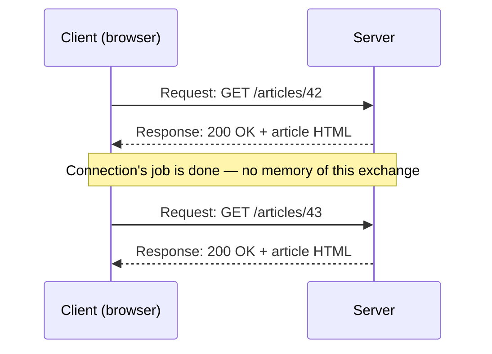

# What Is HTTP

**HTTP** (HyperText Transfer Protocol) is the protocol almost the entire web runs on — an
agreed-upon message format that lets a client (a browser, a mobile app, `curl`) ask a server for
something, and lets the server reply.

## Request-response, not a conversation

HTTP is fundamentally **stateless** and **request-driven**: the client sends one request, the
server sends back exactly one response, and the connection's job for that exchange is done. There
is no ongoing "session" at the protocol level — anything that *feels* like a session (staying
logged in across page loads) is built on top of HTTP using cookies, not part of HTTP itself (see
[Cookies & Sessions](../04-security/cookies-and-sessions.md)).



## Client and server roles

- The **client** always initiates — a server never contacts a browser out of nowhere over plain
  HTTP (real-time updates need something else layered on top, like WebSockets or polling).
- The **server** only ever responds to what it's asked — it can't push unsolicited data mid-request.

This asymmetry is why "the server pushed me a notification" in a modern web app is never plain
HTTP doing that — it's a different mechanism (WebSocket, Server-Sent Events, or the client simply
polling) built alongside it.

## Where HTTP sits in the stack

HTTP is an **application-layer** protocol — it doesn't handle the actual network transport itself,
it rides on top of TCP (or, for HTTP/3, QUIC over UDP — see
[HTTP/1.1 vs. 2 vs. 3](../06-performance-and-protocol-evolution/http-1-1-vs-2-vs-3.md)). TCP's job
is just getting bytes there reliably and in order; HTTP's job is defining what those bytes *mean*
— a request line, headers, an optional body.

## A raw exchange, stripped to its essentials

```text title="What actually goes over the wire (simplified)"
GET /articles/42 HTTP/1.1
Host: example.com
Accept: text/html

---

HTTP/1.1 200 OK
Content-Type: text/html
Content-Length: 1524

<html>...</html>
```

[Requests & Responses](./requests-and-responses.md) breaks this exact shape down piece by piece;
[Status Codes](./status-codes.md) covers what that `200` actually communicates.

## HTTPS is HTTP, plus encryption

HTTPS isn't a separate protocol with different semantics — it's the exact same request/response
model, just run over an encrypted TLS connection. Everything on this page and the rest of this
topic applies identically to both; the encryption layer itself is covered in
[TLS & HTTPS](/study-materials/networking/web-serving/tls-https) in the Networking topic.

## Check yourself

- Why is HTTP called stateless, and what mechanism — not part of HTTP itself — is what actually
  makes "staying logged in" feel like a continuous session?

  <details>
  <summary>Answer</summary>

  HTTP treats every request independently — the server has no built-in memory of previous
  requests. "Staying logged in" is built on top using cookies (a session ID sent back on every
  request), not part of the protocol itself.
  </details>

- Why can't a server push data to a browser using plain HTTP alone?

  <details>
  <summary>Answer</summary>

  HTTP is request-driven — the server can only ever respond to a request the client initiated; it
  has no channel to contact the client unprompted. Real push needs a separate mechanism
  (WebSockets, Server-Sent Events) layered on top.
  </details>

- Where does HTTP sit relative to TCP, and what job does each of the two layers do?

  <details>
  <summary>Answer</summary>

  HTTP is the application-layer protocol that rides on top of TCP (or QUIC/UDP for HTTP/3). TCP's
  job is reliably delivering bytes in order; HTTP's job is defining what those bytes mean (a
  request line, headers, an optional body).
  </details>

- Is HTTPS a different protocol from HTTP, or the same one plus something else? What's the
  "something else"?

  <details>
  <summary>Answer</summary>

  The same protocol, the same request/response semantics — HTTPS just runs it over an encrypted
  TLS connection.
  </details>
