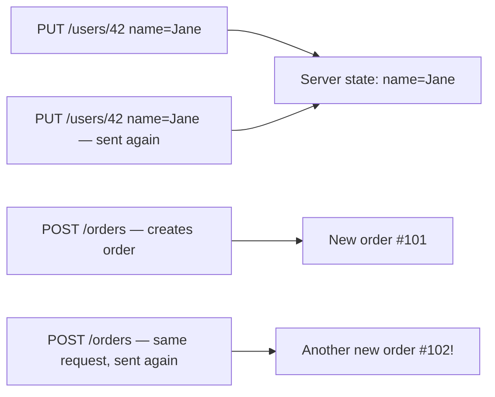

# Idempotency & Safety

Two properties HTTP methods are conventionally expected to follow — not enforced by the protocol
itself, but relied upon by browsers, caches, load balancers, and retry logic everywhere.

## Safe methods

A method is **safe** if it's not expected to change any server state — read-only, by convention.

```
Safe:     GET, HEAD, OPTIONS
Unsafe:   POST, PUT, PATCH, DELETE
```

This is *why* a browser can safely prefetch a link (`GET`) speculatively, or why a search engine's
crawler can hit every `GET` link on your site without worrying about accidentally deleting
anything — as long as your app actually respects the convention. A `GET /articles/42/delete`
endpoint that actually deletes on a plain page load breaks this assumption, and is a genuine,
classic bug class (crawlers deleting data by just following links).

## Idempotent methods

A method is **idempotent** if calling it once has the same effect as calling it many times.

```
Idempotent:     GET, HEAD, PUT, DELETE, OPTIONS
Not idempotent: POST, PATCH (usually)
```



- `PUT /users/42` with the same body twice leaves the resource in the same final state either
  time — idempotent.
- `DELETE /users/42` twice: the first deletes it, the second finds nothing to delete (often still
  returns success, or a 404) — but the *end state* (user 42 doesn't exist) is the same either way
  — still idempotent, even though the *response* might differ.
- `POST /orders` twice creates **two separate orders** — not idempotent, and this is exactly why
  double-clicking a "Place Order" button is a real, historically expensive bug.

`PATCH` is technically allowed to be idempotent or not depending on what it does — a `PATCH` that
sets a field to an exact value is idempotent; one that means "increment this counter by 1" is not.

## Why this distinction is practically important

- **Automatic retries**: an HTTP client (browser, or a library like `axios`/`fetch` with retry
  logic) can safely auto-retry a `GET` or `PUT` on a network failure, because doing it twice is
  harmless. Auto-retrying a `POST` risks duplicating whatever it created.
- **Caching**: only safe methods are cacheable by default — see
  [Caching & ETags](../03-headers-and-content/caching-and-etags.md).
- **API design**: designing an endpoint to actually match its method's expected semantics (see
  [Designing a Good API](../05-rest-and-api-design/designing-a-good-api.md)) is what lets all of
  the above keep working correctly without special-casing.

:::warning
Building a `POST`/action-triggering endpoint that's reachable via `GET` (e.g. a bare link that
deletes something) breaks every one of these assumptions at once — crawlers, browser prefetching,
and proxies all treat `GET` as safe to call speculatively and repeatedly.
:::
