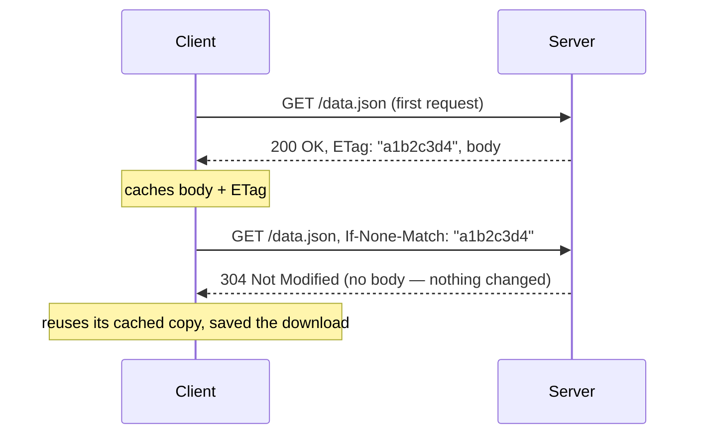

# Caching & ETags

HTTP has built-in caching, controlled entirely through headers — a browser, a CDN, or any proxy in
between can avoid re-fetching content it already has, without the application needing custom
caching logic of its own.

## `Cache-Control` — the main caching header

```http
Cache-Control: max-age=3600              — cacheable for 3600 seconds, then considered stale
Cache-Control: no-cache                    — must revalidate with the server before using a cached copy
Cache-Control: no-store                      — never cache this at all (sensitive data)
Cache-Control: public, max-age=86400           — cacheable by shared caches (CDNs), not just the browser
Cache-Control: private, max-age=3600             — cacheable only by the end user's own browser
```

`no-cache` is a common point of confusion — it does **not** mean "don't cache," it means "cache
it, but check with the server before using it" (see ETags below). `no-store` is the one that
actually means "never cache this."

## ETags — validating a cached copy without re-downloading it

An **ETag** is an opaque identifier (often a hash) the server attaches to a specific version of a
resource:

```http
HTTP/1.1 200 OK
ETag: "a1b2c3d4"
Cache-Control: no-cache
```

Next time the client wants that resource, it can ask "is this still current" instead of
re-downloading blindly:



A `304 Not Modified` response has **no body** — the whole point is avoiding re-sending data the
client already has. If the resource *did* change, the server just responds normally with `200` and
a new `ETag`.

## Why this matters practically

- **Bandwidth**: a `304` response is tiny compared to re-sending a full body — meaningful at scale
  for anything requested often (images, JS/CSS bundles, API responses that don't change often).
- **CDNs rely on this entirely** — a CDN edge node serving cached content on your behalf is just
  automating exactly this Cache-Control/ETag negotiation, at a layer in front of your server (see
  [CDNs & Edge Caching](../06-performance-and-protocol-evolution/cdns-and-edge-caching.md)).
- **Cache invalidation bugs** are almost always a `Cache-Control` header set too aggressively (or
  missing entirely) — "I deployed a fix but users still see the old version" is, more often than
  not, a caching header problem, not a deployment problem.

## `Last-Modified` — a simpler, coarser alternative to ETag

```http
Last-Modified: Wed, 21 Oct 2026 07:28:00 GMT
```

```http
If-Modified-Since: Wed, 21 Oct 2026 07:28:00 GMT
```

Same idea as ETag, but based on a timestamp instead of a content hash — coarser (can't detect a
change that happens within the same second, and doesn't detect a revert to identical content the
way a hash-based ETag naturally would), but simpler for a server to generate when a precise
content hash isn't readily available.

## Check yourself

- What's the actual difference between `Cache-Control: no-cache` and `no-store`?

  <details>
  <summary>Answer</summary>

  `no-cache` means "cache it, but revalidate with the server before using it." `no-store` means
  "never cache this at all."
  </details>

- What does an `ETag` let a client ask the server, and what does the server reply when nothing
  changed?

  <details>
  <summary>Answer</summary>

  It lets the client ask "is this still current" (via `If-None-Match`). If nothing changed, the
  server replies `304 Not Modified` with no body.
  </details>

- Why does a `304 Not Modified` response have no body?

  <details>
  <summary>Answer</summary>

  Because its whole point is avoiding re-sending data the client already has — including a body
  would defeat the purpose.
  </details>

- Why is "cache invalidation," not a bad deploy, often the real cause of "I shipped a fix but users
  still see the old version"?

  <details>
  <summary>Answer</summary>

  Because the browser or CDN is still legitimately serving whatever it was told to cache — it's
  almost always a `Cache-Control` header set too aggressively (or missing entirely), not a broken
  deployment.
  </details>
