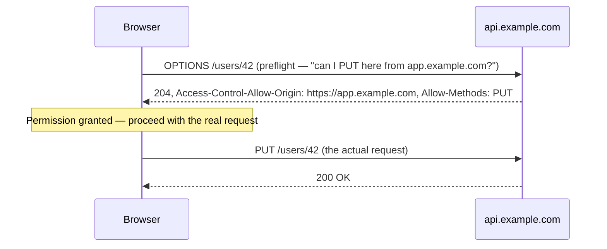

# Same-Origin Policy & CORS

## What an "origin" is

An origin is the combination of **scheme + host + port**:

```
https://app.example.com:443
   ^         ^            ^
scheme      host         port
```

Two URLs share an origin only if all three match exactly — `https://app.example.com` and
`http://app.example.com` are **different origins** (different scheme), as are
`https://app.example.com` and `https://api.example.com` (different host), even though they look
closely related.

## The same-origin policy

Browsers enforce the **same-origin policy** by default: JavaScript running on one origin cannot
read the response of a request made to a different origin, unless that other origin explicitly
allows it. This is a security boundary, not a networking limitation — the request can often still
technically be *sent*, the browser just blocks the *page's script* from reading the result.

Without this, a malicious site could silently run JavaScript that reads your logged-in banking
session's data, just because your browser happened to have both tabs open.

## CORS — the explicit opt-in

**CORS** (Cross-Origin Resource Sharing) is how a server grants an exception to that default block
— response headers telling the browser "this specific other origin is allowed to read this."

```http
Access-Control-Allow-Origin: https://app.example.com
Access-Control-Allow-Methods: GET, POST, PUT
Access-Control-Allow-Headers: Content-Type, Authorization
```

## Simple requests vs. preflight

A "simple" request (plain `GET`/`POST` with only a few allowed headers) goes straight through,
and the browser checks the `Access-Control-Allow-Origin` header on the actual response. Anything
more complex (a custom header, `PUT`/`DELETE`, a JSON body on certain configurations) triggers a
**preflight** — the browser sends an `OPTIONS` request *first*, asking permission, before sending
the real one:



The preflight is invisible in application code — the browser handles it automatically — but it's
exactly why a `PUT`/`DELETE` API call can show *two* requests in network dev tools instead of one.

## `Access-Control-Allow-Origin: *` — what it actually permits, and doesn't

```http
Access-Control-Allow-Origin: *
```

Allows **any** origin to read the response — fine for a public, non-sensitive API (public data,
no cookies involved). It specifically **cannot** be combined with credentialed requests (cookies,
`Authorization` headers relying on browser-stored credentials) — a browser will refuse to expose
the response to a credentialed request if the origin is a wildcard, precisely to prevent using a
public `*` policy to leak authenticated data.

:::warning
CORS is a **browser-enforced** protection — it does nothing to stop a non-browser client (`curl`,
a server-to-server request, Postman) from reading a response. It protects users' browsers from
malicious *websites*, not your API from all possible callers. Never rely on CORS as your actual
access control — that still has to happen server-side (auth checks, API keys), CORS just governs
what a *browser page* is allowed to read.
:::

## Why this exists at all in this org's context

Static sites without their own backend API (like this docs site, or a purely front-end app) rarely
trigger CORS themselves — it becomes relevant the moment any JavaScript on one origin needs to
call an API hosted on a different origin, which is common in more complex web apps even if not
in play here directly.
