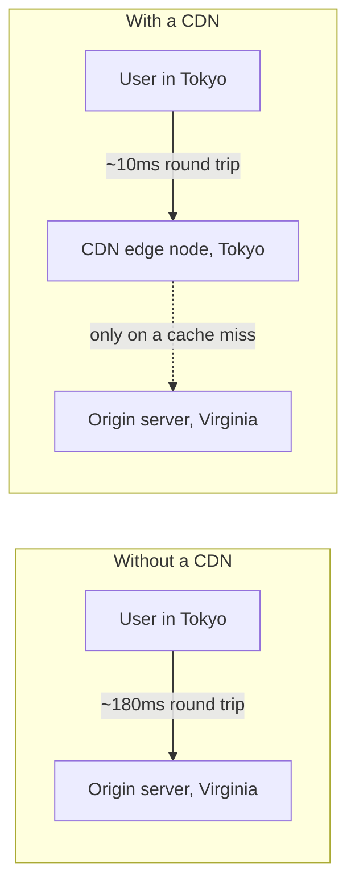

# CDNs & Edge Caching

A **CDN** (Content Delivery Network) is a network of servers distributed geographically, caching
copies of content close to where users actually are — an extension of the same
[Caching & ETags](../03-headers-and-content/caching-and-etags.md) mechanics HTTP already provides,
just running at many locations instead of one origin server.

## Why physical location matters

Latency is bounded by physical distance — no amount of server optimization removes the time it
takes light (or an electrical signal) to travel a long physical distance. A user in Tokyo fetching
a resource from a server in Virginia pays that round-trip cost on every single request, no matter
how fast that origin server responds internally.



A CDN edge node close to the user serves a cached copy directly — the far-away origin server is
only involved when the edge node doesn't already have a valid cached copy.

## What actually gets cached at the edge

Static, cacheable assets are the natural fit: images, CSS, JS bundles, fonts, and — for a fully
static site (see [Deploying a Static Site](/study-materials/networking/practical-setups/deploying-a-static-site)
in the Networking topic) — the HTML itself. Dynamic, personalized, or frequently-changing content
(a logged-in user's dashboard, a live search result) is typically **not** cached at the edge by
default, since caching it wrong risks serving one user's private data to another.

## Cache invalidation — the genuinely hard part

The classic line ("there are only two hard problems in computer science: cache invalidation and
naming things") applies directly here. Once an edge node has cached a response, it keeps serving
that cached copy until either its `Cache-Control` `max-age` expires, or something explicitly
tells it to drop the cache early:

```bash
# a typical CDN purge/invalidation API call, conceptually
curl -X POST https://cdn-provider.example.com/purge -d '{"url": "https://example.com/app.js"}'
```

A deploy that changes a file's *content* but not its *URL* risks users continuing to see the old
version until the cache naturally expires or is explicitly purged — this is why many build tools
add a content hash to filenames (`app.a1b2c3.js`) instead of reusing the same filename forever: a
changed file gets a genuinely new URL, sidestepping invalidation entirely rather than needing to
purge anything.

## Why this doesn't replace origin-server caching headers

A CDN edge node still respects the same `Cache-Control`/`ETag` headers the origin server sets (see
[Caching & ETags](../03-headers-and-content/caching-and-etags.md)) — it's not a separate caching
system with its own rules, it's the same HTTP caching contract, just enforced at many more
physical locations than one. Misconfigured cache headers cause exactly the same problems at a CDN
edge as they would with browser caching alone, just at a larger, more visible scale since it
affects every user hitting that edge node, not just one browser.
