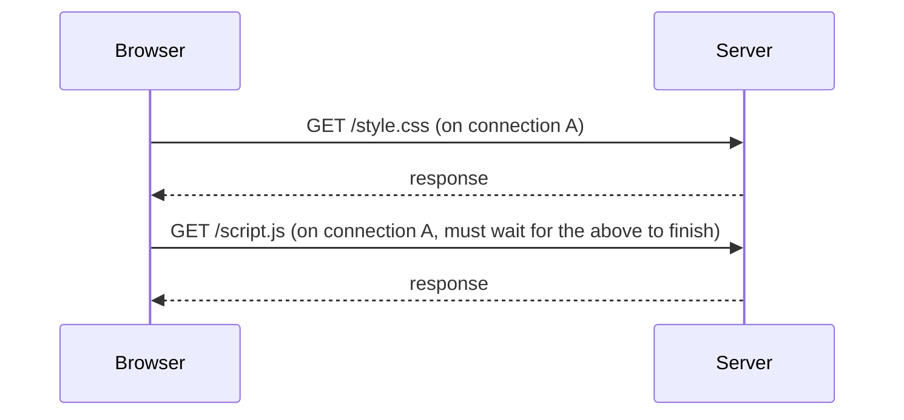
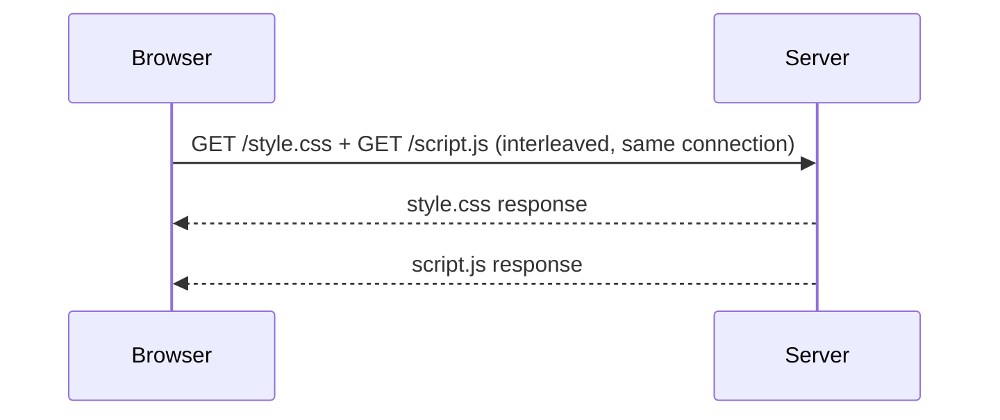

# HTTP/1.1 vs. 2 vs. 3

Same request/response model across all three versions (see
[What Is HTTP](../01-basics/what-is-http.md)) — what changed each time is the underlying transport
mechanics, aimed at fixing real performance problems of the version before it.

## HTTP/1.1 — one request at a time, per connection



A single TCP connection handles requests **one at a time** — a second request has to wait for the
first to fully finish (this is "head-of-line blocking" at the HTTP layer). Browsers historically
worked around this by opening multiple parallel TCP connections to the same server (commonly 6),
which helps, but each connection still carries its own TCP handshake overhead.

## HTTP/2 — multiplexing over one connection



Multiple requests and responses share **one** TCP connection simultaneously, interleaved — no
more waiting for one to finish before sending the next. Also introduced header compression
(HPACK) and server push (mostly abandoned in practice — turned out hard to use correctly, most
implementations have deprecated it).

This solves head-of-line blocking **at the HTTP layer**, but a problem remains one layer down.

## HTTP/3 — fixing head-of-line blocking at the TCP layer itself

HTTP/2's multiplexing still rides on a single **TCP** connection — and TCP itself guarantees
strict byte order. If one packet is lost, TCP blocks *everything* on that connection until the
lost packet is retransmitted and arrives — even data for a completely unrelated request that
already arrived fine. This is head-of-line blocking again, just moved down to the transport layer.

**HTTP/3** runs over **QUIC** (built on UDP, not TCP) instead — QUIC implements its own
reliability, but per-stream rather than for the whole connection: a lost packet only blocks the
one stream it belongs to, not every other in-flight request sharing the connection.

```text
HTTP/1.1  →  TCP    (one request at a time per connection)
HTTP/2    →  TCP    (multiplexed, but one lost packet blocks everything on the connection)
HTTP/3    →  QUIC/UDP  (multiplexed, a lost packet only blocks its own stream)
```

## Why this matters practically, even without touching the protocol directly

Almost none of this requires application code changes — a web server (or the reverse proxy in
front of it, see
[Reverse Proxies](/study-materials/networking/web-serving/reverse-proxies) in the Networking
topic) negotiates the HTTP version with the client automatically, transparently to the
application. What it does explain:

- Why bundling many small files used to matter far more under HTTP/1.1 (fewer round trips) than
  it does under HTTP/2 (multiplexing already avoids most of that cost) — a real shift in frontend
  build tooling's conventional wisdom over the years.
- Why a slightly lossy network (mobile, weak Wi-Fi) can make an HTTP/2 site feel surprisingly slow
  despite multiplexing — a single dropped packet stalls the whole connection at the TCP layer,
  which is precisely the problem HTTP/3 targets.

## Check yourself

- What specific problem does HTTP/2 solve that HTTP/1.1 has, and what mechanism does it use to
  solve it?

  <details>
  <summary>Answer</summary>

  Head-of-line blocking at the HTTP layer (only one request at a time per connection). HTTP/2
  fixes it by multiplexing multiple requests and responses over one TCP connection simultaneously.
  </details>

- What problem remains even after HTTP/2, and why does it exist "one layer down"?

  <details>
  <summary>Answer</summary>

  Head-of-line blocking still happens, just moved to the TCP layer — TCP guarantees strict byte
  order, so one lost packet blocks everything on the connection, even unrelated requests that
  already arrived fine.
  </details>

- What does HTTP/3 change to fix that remaining problem, and why does that fix actually work?

  <details>
  <summary>Answer</summary>

  HTTP/3 runs over QUIC (UDP) instead of TCP, implementing reliability per-stream instead of for
  the whole connection — a lost packet only blocks the one stream it belongs to, not every other
  in-flight request.
  </details>
