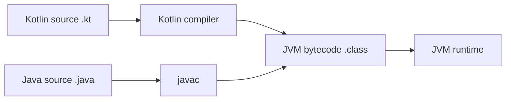

# What Is Kotlin

Kotlin is a statically-typed language that runs primarily on the JVM — fully interoperable with
Java, compiling to the same bytecode, able to call Java libraries directly and be called from Java
in return. It also targets other platforms (Kotlin/Native for native binaries, Kotlin/JS for the
browser), but the JVM is by far its most common home, including for backend frameworks like Spring
Boot.

## Why teams choose it over Java

```kotlin
// Kotlin
data class User(val name: String, val email: String)

fun greet(user: User?) = user?.let { "Hello, ${it.name}!" } ?: "Hello, stranger!"
```

```java
// The equivalent in plain Java is meaningfully more code —
// a full class with a constructor, getters, equals/hashCode/toString,
// plus explicit null checking.
```

- **Conciseness** — data classes, type inference, and expression-oriented syntax cut a lot of
  Java's structural boilerplate without losing static typing.
- **Null safety** — nullability is part of the type system itself, not a convention enforced by
  discipline and hope — see [Null Safety](./null-safety.md), the single most-cited reason teams
  migrate.
- **Coroutines** — lightweight concurrency built into the language, not bolted on as a library
  concept the way Java's `Thread`/`ExecutorService` are.

## Full Java interop, both directions

```kotlin
// Kotlin calling an existing Java class directly, no wrapper needed
val list = java.util.ArrayList<String>()
list.add("hello")
```

```java
// Java calling a Kotlin class works the same way, calling it like any other Java class
User user = new User("Jane", "jane@example.com");
```

This interop is why teams can adopt Kotlin **incrementally** — converting one file or one module
at a time in an existing Java codebase, rather than needing an all-or-nothing rewrite. See
[Kotlin/Java Interop](../06-interop-and-tooling/kotlin-java-interop.md) for the mechanics.

## Compiles to JVM bytecode — same runtime as Java



Both compilers produce the same kind of bytecode, run by the same JVM — this is *why* interop
works so seamlessly: at runtime, there's no meaningful difference between a class that started as
Kotlin source and one that started as Java source.

## Other Kotlin targets, briefly

```text
Kotlin/JVM      — the default target, runs anywhere a JVM does (this is what this topic assumes)
Kotlin/Native    — compiles to a native binary, no JVM needed (iOS, embedded, CLI tools)
Kotlin/JS          — compiles to JavaScript, runs in a browser or Node.js
Kotlin Multiplatform — sharing code across some or all of the above targets from one codebase
```

This topic, and the related Kotlin topics in this study-materials section (Idioms & Advanced
Features, Coroutines & Concurrency, Kotlin + Spring Boot, Testing in Kotlin), all assume
Kotlin/JVM — the multiplatform targets are a large enough subject to be genuinely out of scope
here.

## Where to start

[Variables & Types](./variables-and-types.md) covers the basic syntax; [Null Safety](./null-safety.md)
covers the feature that most shapes how idiomatic Kotlin code actually looks.
