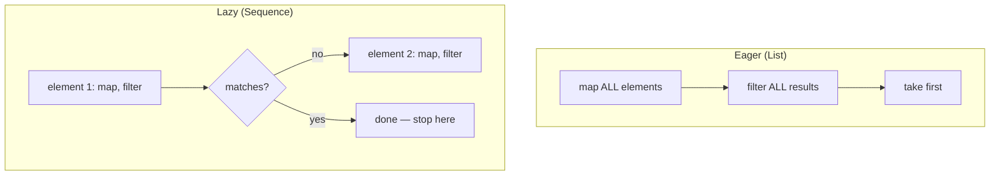

# Sequences

`Sequence<T>` is Kotlin's lazy alternative to eagerly-evaluated collection operations — the same
`map`/`filter`/etc. vocabulary from [Functional Operations](./functional-operations.md), but
evaluated element-by-element only when a terminal operation actually needs the result.

## Eager vs. lazy, concretely

```kotlin
val result = listOf(1, 2, 3, 4, 5)
    .map { println("map: $it"); it * 2 }
    .filter { println("filter: $it"); it > 4 }
    .first()
```

With a plain `List`, `map` runs **fully** across all 5 elements first, producing a whole new list,
**then** `filter` runs fully across that whole new list, producing another whole list, and only
then does `first()` grab the first result — even though only the very first matching element was
actually needed.

```kotlin
val result = listOf(1, 2, 3, 4, 5).asSequence()
    .map { println("map: $it"); it * 2 }
    .filter { println("filter: $it"); it > 4 }
    .first()
```

With `.asSequence()`, each element flows through the **entire chain** (map, then filter) one at a
time, and processing stops as soon as `first()` finds a match — no wasted work on elements 4 and 5
that were never needed.



## When it actually matters for performance

```text
Matters:
  - Large collections where an intermediate step is expensive
  - Chains that short-circuit early (first, find, take(n), any) — sequences can stop early,
    eager collections process everything regardless
  - Long chains of multiple operations, where eager evaluation creates a full intermediate
    list after EACH step

Doesn't really matter:
  - Small collections (a few dozen elements) — the overhead of sequence machinery itself can
    outweigh any savings
  - A single operation with no early-exit (e.g. just one .map() over the whole list) — little
    difference either way
```

:::note
`Sequence` isn't "always faster" — it trades away some eager-list optimizations (certain
operations are genuinely faster on a `List` when you need the *entire* result anyway) in exchange
for avoiding intermediate collections and enabling early termination. Reach for `.asSequence()`
deliberately, for large collections or short-circuiting chains, not as a reflexive "sequences are
better" habit.
:::

## Infinite sequences — something a `List` fundamentally can't do

```kotlin
val naturalNumbers = generateSequence(1) { it + 1 }    // 1, 2, 3, 4, ... forever

val firstFiveSquares = naturalNumbers
    .map { it * it }
    .take(5)
    .toList()

println(firstFiveSquares)    // [1, 4, 9, 16, 25]
```

An eagerly-evaluated `List` genuinely cannot represent an infinite collection at all — it would
need to fully materialize every element. A lazy `Sequence` only computes what's actually consumed,
so `generateSequence` combined with `take(n)` works perfectly even though the underlying sequence
is conceptually endless.

## Converting between the two

```kotlin
val list = listOf(1, 2, 3)
val sequence = list.asSequence()      // List -> Sequence, no data copied, just wraps it lazily
val backToList = sequence.toList()      // Sequence -> List, forces full evaluation now
```
