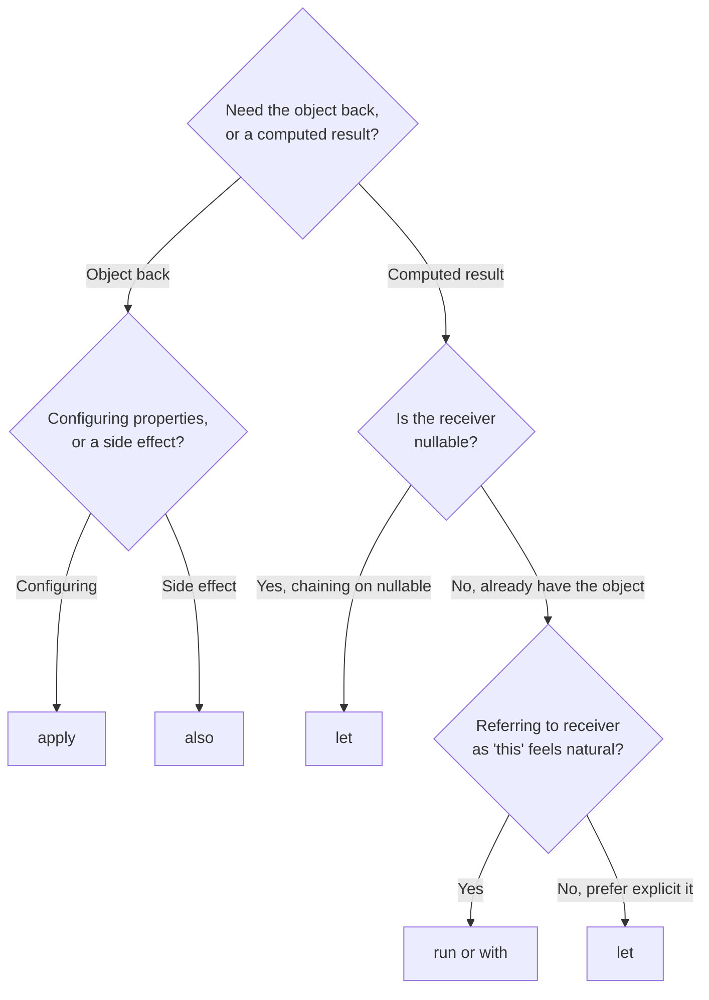

# Choosing the Right Scope Function

[let, run, with](./let-run-with.md) and [apply, also](./apply-also.md) cover all five individually
— this page is the practical decision guide once you know what each does and need to pick one
quickly.

## The full comparison

| Function | Receiver | Returns | Best for |
|---|---|---|---|
| `let` | `it` | Lambda result | Null-safety chains, transforming a value into something else |
| `run` (with receiver) | `this` | Lambda result | Chaining computation directly off an object |
| `run` (no receiver) | — | Lambda result | Scoping a block of temporary variables |
| `with` | `this` | Lambda result | Grouping several calls on an already-existing, non-null object |
| `apply` | `this` | The object | Configuring a freshly created object's own properties |
| `also` | `it` | The object | A side effect (logging, validating) without modifying the object |

## Two questions that pick the right one



1. **Do you need the original object back, or a newly computed value?**
   Object back → `apply`/`also`. Computed value → `let`/`run`/`with`.
2. **If a computed value: is the receiver nullable, or do you want the explicit `it`?**
   `let` handles both — it's the natural default for a nullable chain (`?.let { }`) or whenever
   `it` reads more clearly than implicit `this`.

## A worked example choosing between them

```kotlin
data class User(var name: String = "", var age: Int = 0, val id: String = "")

// Configuring a new object → apply
val user = User().apply {
    name = "Jane"
    age = 30
}

// Side effect mid-chain, object unchanged → also
val validUser = user
    .also { require(it.age >= 0) { "Age cannot be negative" } }

// Nullable chain, transforming into something else → let
val greeting: String? = findUserById(id)?.let { "Hello, ${it.name}!" }

// Several calls on an existing, known-non-null object → with
val summary = with(user) {
    "$name is $age years old"
}
```

## When *not* to reach for a scope function at all

```kotlin
❌ val x = someValue.let { it + 1 }
✅ val x = someValue + 1
```

A scope function that doesn't actually simplify anything — wrapping a single trivial expression
just because it's available — adds a layer of indirection for no real benefit. They're genuinely
useful for null-safety chains, object configuration, and grouping related calls; reaching for one
reflexively on every line makes code harder to read, not easier, which defeats the entire point of
an idiom meant to improve readability.

## Common mistake: nesting scope functions and losing track of `this`/`it`

```kotlin
❌ // which `it` does this refer to at each point? genuinely hard to tell at a glance
outer.let { o ->
    inner.let {
        process(o, it)
    }
}
```

Nesting scope functions of the same kind is a real readability trap — naming the parameter
explicitly (`let { o -> ... }` instead of relying on implicit `it`) at every level, or simply
avoiding the nesting with a named intermediate variable, keeps this from becoming a
"whose `it` is this" puzzle for the next reader.
