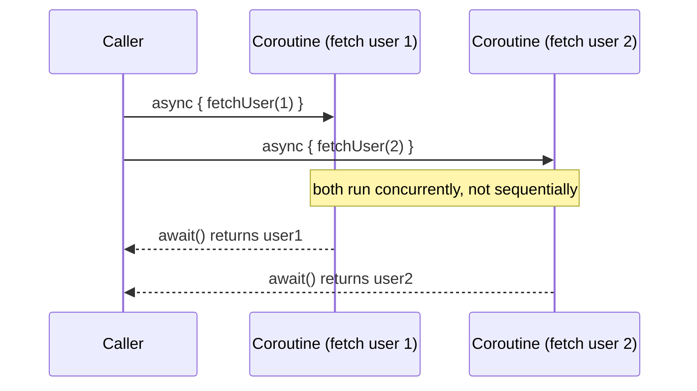

# Launch vs. Async

The two fundamental **coroutine builders** — functions that actually start a new coroutine.
Everything else in this topic assumes one of these two got things running in the first place.

## `launch` — fire-and-forget, returns a `Job`

```kotlin
fun main() = runBlocking {
    val job: Job = launch {
        delay(500L)
        println("Task done")
    }
    println("Coroutine launched")
    job.join()    // suspend until the launched coroutine finishes
}
// Output:
// Coroutine launched
// Task done
```

Use `launch` when you care that something *happens*, but don't need a result value back from it —
logging, sending a notification, updating some state as a side effect. The returned `Job` lets
you wait for completion (`.join()`) or cancel it (`.cancel()`), but carries no result value.

## `async` — returns a value, via a `Deferred`

```kotlin
fun main() = runBlocking {
    val deferred: Deferred<Int> = async {
        delay(500L)
        42
    }
    println("Waiting for result...")
    val result = deferred.await()    // suspend until the value is ready
    println("Got: $result")
}
// Output:
// Waiting for result...
// Got: 42
```

Use `async` when you need the actual **return value** of the concurrent work — `.await()`
suspends until it's ready, and (unlike `launch`) propagates any exception the coroutine threw
right there at the `.await()` call site (see
[Exception Handling in Coroutines](../05-error-handling-and-testing/exception-handling-in-coroutines.md)
for exactly how this differs from `launch`'s exception behavior).

## Running two things concurrently — the actual point of `async`

```kotlin
suspend fun fetchTwoUsersConcurrently(): Pair<User, User> = coroutineScope {
    val deferred1 = async { fetchUser(1) }
    val deferred2 = async { fetchUser(2) }
    deferred1.await() to deferred2.await()    // both requests already running concurrently by now
}
```



Compare this to calling both suspend functions sequentially (see
[Suspend Functions](./suspend-functions.md)) — starting both with `async` *before* calling
`.await()` on either is what actually makes them run concurrently rather than one after another.
Calling `.await()` immediately after each `async` call, instead of after both are started, would
accidentally serialize them again.

## Side by side

| | `launch` | `async` |
|---|---|---|
| Returns | `Job` | `Deferred<T>` |
| Has a result value | No | Yes, via `.await()` |
| Typical use | Side effects, fire-and-forget work | Concurrent computation you need the result of |
| Uncaught exception behavior | Propagates immediately to the parent | Held until `.await()` is called |

## A common mistake: forgetting to actually use the result

```kotlin
// ❌ started concurrent work, never retrieved the result — and if it throws, the exception is
//    silently held until something eventually calls .await() (or never surfaces at all)
async { riskyOperation() }

// ✅ if you don't need the result, use launch instead — its exception behavior is more predictable
launch { riskyOperation() }
```

If a coroutine's return value is never actually needed, `launch` is the more honest choice — using
`async` and never calling `.await()` is a common source of confusion, both about missed results
and about exceptions that don't surface when expected.
