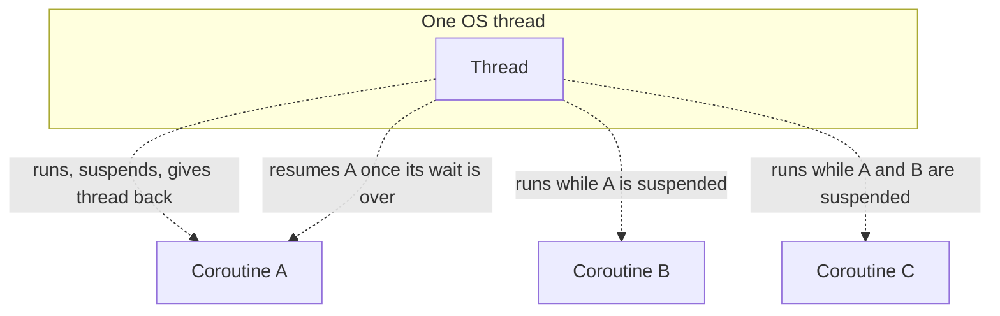

# What Are Coroutines

A **coroutine** is a unit of concurrent work that can be **suspended** and **resumed** without
blocking the underlying OS thread it happens to be running on. Kotlin coroutines are often
described as "lightweight threads" — a useful first intuition, but the mechanism underneath is
genuinely different, not just a smaller version of a thread.

## Suspension, not blocking

An OS thread that's waiting (for I/O, for a lock, for `Thread.sleep`) is **blocked** — it sits
there doing nothing, but the OS still has to schedule it, and it still holds onto its own stack
and memory the whole time. A suspended coroutine gives the thread back entirely — the thread is
free to run other coroutines while this one waits, and the coroutine's own state is saved
separately, resumed later, possibly even on a different thread.



This is why a single thread can interleave thousands of coroutines — nothing is actually blocked
holding that thread hostage while waiting.

## Why this matters at scale

```text
Threads:     a few hundred to a few thousand, realistically, before OS scheduling overhead and
             per-thread memory (each OS thread reserves its own stack, often 512KB-1MB) becomes
             a real bottleneck
Coroutines:  tens of thousands to millions are practical — a suspended coroutine's state is a
             small object on the heap, not a reserved OS-level stack
```

A server handling many concurrent connections, each mostly waiting on I/O (a database query, an
HTTP call to another service) rather than doing continuous CPU work, is the classic case where
this difference is the whole point — most of those "threads" would spend nearly all their time
just blocked waiting, at real memory cost, for no actual benefit.

## A first example

```kotlin
import kotlinx.coroutines.*

fun main() = runBlocking {
    launch {
        delay(1000L)          // suspends this coroutine — does NOT block the thread
        println("World!")
    }
    println("Hello,")
}
// Output:
// Hello,
// World!
```

`delay` is a **suspending function** (see [Suspend Functions](./suspend-functions.md)) — it
suspends the coroutine for 1 second without blocking the thread `main` is running on, which is why
`"Hello,"` prints immediately, before the delayed coroutine resumes and prints `"World!"`.
Compare this to `Thread.sleep(1000L)`, which *would* block the thread — nothing else could run on
it during that second.

## Coroutines are not a replacement for threads — they run on top of them

Coroutines still need actual OS threads to execute on eventually — a **dispatcher** (see
[Dispatchers](../03-dispatchers-and-threading/dispatchers.md)) decides which thread pool a given
coroutine actually runs on. Coroutines are a way to use threads far more efficiently, not a way to
avoid needing them at all.

## Where this fits with the rest of this topic

- [Suspend Functions](./suspend-functions.md) — the language feature that makes suspension
  possible at all.
- [Launch vs. Async](./launch-vs-async.md) — the two basic ways to actually start a coroutine.
- [Structured Concurrency Explained](../02-structured-concurrency/structured-concurrency-explained.md)
  — the design principle that governs how coroutines relate to each other, arguably the single
  most important idea in this whole topic.

This topic assumes you're already comfortable with Kotlin itself — see the
[Kotlin Fundamentals](/study-materials/kotlin/kotlin-fundamentals/basics/what-is-kotlin) topic if functions, classes, and
lambdas in Kotlin aren't yet familiar ground.
