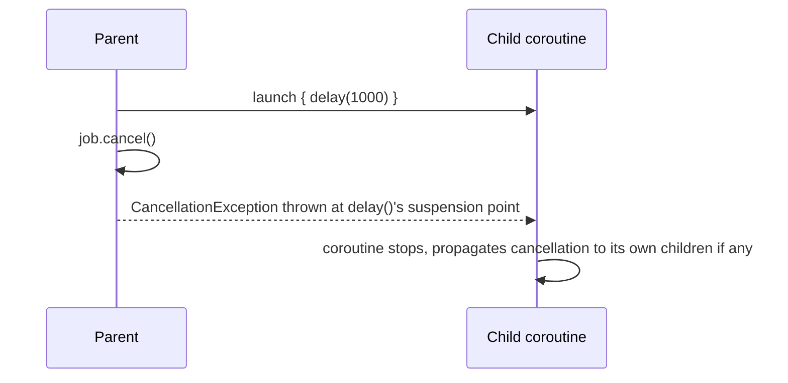

# Cancellation

Cancellation in Kotlin coroutines is **cooperative** — a coroutine has to actually check whether
it's been cancelled and stop itself. Nothing forcibly interrupts a running coroutine the way, say,
killing an OS thread might.

## Requesting cancellation

```kotlin
val job = launch {
    repeat(1000) { i ->
        delay(100L)
        println("Working... $i")
    }
}
delay(350L)
job.cancel()      // requests cancellation
job.join()          // suspend until it's actually finished cancelling
// or, combined:
job.cancelAndJoin()
```

## Why "cooperative" — and what makes a coroutine actually respond

Suspending functions from `kotlinx.coroutines` (`delay`, `yield`, and most others) check for
cancellation automatically at their suspension points, and throw a `CancellationException` if the
coroutine has been cancelled — this is *how* cancellation actually takes effect, not a side
detail.

```kotlin
val job = launch {
    var i = 0
    while (i < 1000) {
        // ❌ no suspension point here at all — this loop will NOT respond to cancel()
        i++
    }
}
```

:::warning
A tight loop with no suspending call inside it will not respond to `cancel()` — the coroutine
never reaches a point where cancellation is actually checked. This is a genuinely common source of
"I called `.cancel()` but it's still running" bugs — the fix is to either call a suspending
function periodically (even a cheap one like `yield()`), or explicitly check `isActive`:

```kotlin
val job = launch {
    var i = 0
    while (isActive) {    // explicitly checks cancellation status
        i++
    }
}
```
:::

## `CancellationException` — a special exception, not a normal error

```kotlin
val job = launch {
    try {
        delay(1000L)
    } catch (e: CancellationException) {
        println("Cleaning up before cancellation completes")
        throw e    // important: re-throw it, don't swallow it
    }
}
```

`CancellationException` is how cancellation is actually implemented under the hood — it's thrown
at the suspension point, propagates like any exception, but coroutine machinery treats it as
"this was cancelled," not "this failed" (see
[Exception Handling in Coroutines](../05-error-handling-and-testing/exception-handling-in-coroutines.md)
for the distinction in practice). Catching it to do cleanup is fine and common; **swallowing it
without re-throwing breaks cancellation** for anything downstream expecting it to propagate.

## Cancellation and structured concurrency together



This is exactly the mechanism behind
[Structured Concurrency](./structured-concurrency-explained.md)'s automatic cancellation
propagation — cancelling a parent scope works by cancelling its `Job`, which cancels every child
`Job`, which (via suspension points) actually stops each coroutine's execution.

## `withTimeout` — cancellation on a deadline

```kotlin
try {
    withTimeout(1000L) {
        delay(2000L)    // this will be cancelled after 1000ms — withTimeout throws
    }
} catch (e: TimeoutCancellationException) {
    println("Took too long")
}
```

A common, practical use of the same cancellation mechanism — automatically cancel work that's
taking longer than acceptable, rather than manually tracking elapsed time yourself.
