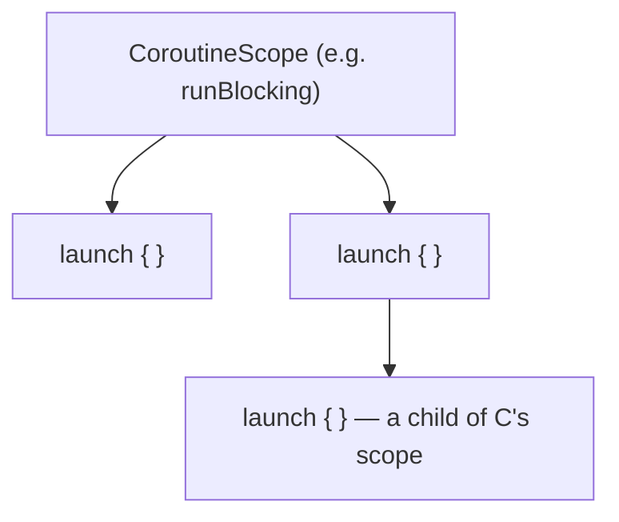

# CoroutineScope & CoroutineContext

Two related but distinct pieces of machinery underneath every coroutine — a `CoroutineScope`
defines *where a coroutine lives*, a `CoroutineContext` defines *what governs how it runs*.

## `CoroutineContext` — a set of elements

A `CoroutineContext` is an indexed set holding things like which `Job` this coroutine belongs to,
which dispatcher it runs on, and an optional name for debugging.

```kotlin
val context = Dispatchers.IO + CoroutineName("data-fetch")
```

Contexts combine with `+` — the right-hand element of the same kind overrides the left's. This is
why `withContext(Dispatchers.IO)` (see
[Context Switching](../03-dispatchers-and-threading/context-switching.md)) can swap just the
dispatcher while everything else in the context stays the same.

```kotlin
launch(Dispatchers.Default + CoroutineName("worker")) {
    println(coroutineContext[CoroutineName])    // CoroutineName(worker)
}
```

## `CoroutineScope` — where a coroutine's lifetime lives

A `CoroutineScope` wraps a `CoroutineContext` and provides the actual boundary a coroutine's
lifetime is tied to. Every coroutine builder (`launch`, `async`) is an **extension function** on
`CoroutineScope` — you cannot call `launch` without one, by design.

```kotlin
class UserRepository {
    private val scope = CoroutineScope(Dispatchers.IO + SupervisorJob())

    fun refreshUser(id: Int) {
        scope.launch {
            val user = fetchUser(id)
            // ... use the result
        }
    }

    fun close() {
        scope.cancel()    // cancels every coroutine started via this scope, all at once
    }
}
```

This pattern — a class owning a scope tied to its own lifecycle, cancelling it when the class is
done — is the standard way to make sure coroutines don't outlive the thing that started them (see
[Structured Concurrency Explained](./structured-concurrency-explained.md) for why that matters).

## `runBlocking` and `coroutineScope` — two ways to get a scope inside suspend code

```kotlin
fun main() = runBlocking {           // creates a scope, BLOCKS the current thread until done
    launch { /* ... */ }
}

suspend fun doWork() = coroutineScope {   // creates a scope, does NOT block — suspends instead
    launch { /* ... */ }
}
```

`runBlocking` genuinely blocks its thread — appropriate for `main()` or a test, where something
has to bridge blocking and suspending code. `coroutineScope` is itself a suspend function — it
doesn't block anything, it just creates a scope and suspends until all coroutines launched inside
it complete. Reaching for `runBlocking` inside otherwise-suspending production code (rather than at
a genuine blocking/suspending boundary) is a common mistake — see
[Blocking Calls in Coroutines](../06-common-pitfalls/blocking-calls-in-coroutines.md).

## Where scopes nest



Every `launch`/`async` call creates a **child** coroutine of the scope it was called in — and a
coroutine builder called from *inside* another coroutine creates a scope that's itself a child of
that coroutine. This nesting is the literal mechanism behind
[structured concurrency](./structured-concurrency-explained.md): a parent scope knows about every
coroutine launched (directly or transitively) within it.
