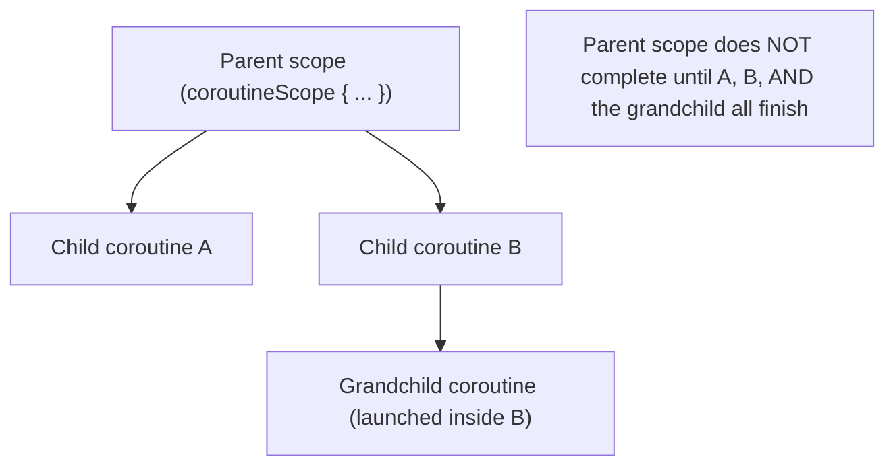
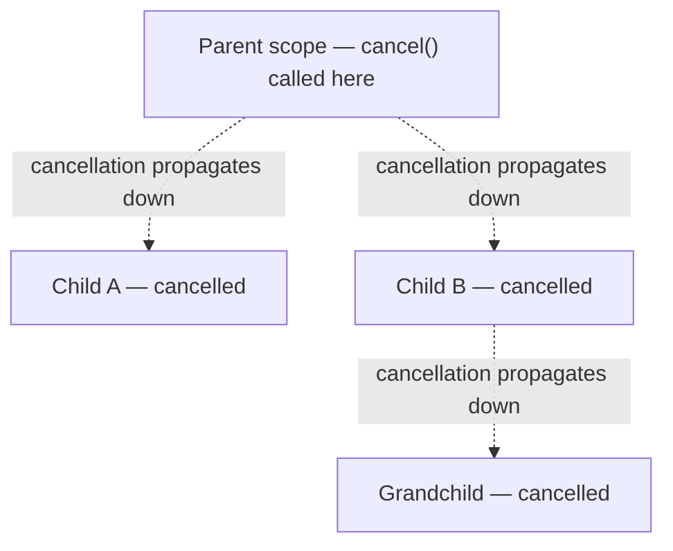
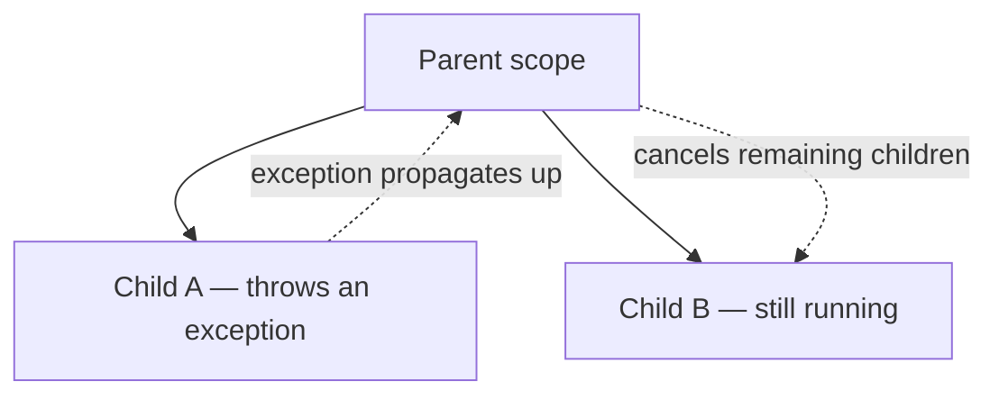

# Structured Concurrency Explained

Arguably the single most important idea in Kotlin's whole coroutines design — and the thing that
most clearly separates it from "just async/await with extra syntax."

## The core rule

**A coroutine's lifetime is bound to the scope it was launched in — a scope doesn't complete
until every coroutine launched within it (including transitively, children of children) has
completed.**



This isn't a convention or best practice — it's enforced by the coroutine machinery itself.
There's no way to launch a coroutine that silently "escapes" its parent scope and keeps running
after the parent thinks it's done (short of deliberately using an unscoped builder like
`GlobalScope`, covered as an anti-pattern in
[Common Coroutine Mistakes](../06-common-pitfalls/common-coroutine-mistakes.md)).

## Why this matters — the problem it actually solves

Without structured concurrency, "fire off some async work" easily leads to:

```text
- Leaked coroutines that keep running after the code that started them has moved on, silently
  consuming resources for no one's benefit
- No reliable way to know when "all the work" is actually done
- A cancelled operation whose spawned background work keeps going anyway
```

```kotlin
// ❌ unstructured — nothing ties this coroutine's lifetime to anything
fun startBackgroundTask() {
    GlobalScope.launch {
        doWork()   // keeps running even if the caller has long since moved on / been destroyed
    }
}

// ✅ structured — tied to a scope with a real, bounded lifetime
class Worker(private val scope: CoroutineScope) {
    fun startBackgroundTask() {
        scope.launch {
            doWork()   // cancelled automatically if `scope` is cancelled
        }
    }
}
```

## Cancellation propagates through the structure automatically



Cancelling a parent scope cancels every coroutine nested within it, automatically, all the way
down — you never have to manually track and cancel each child individually. See
[Cancellation](./cancellation.md) for the mechanics of how a coroutine actually responds to being
cancelled.

## An exception in a child propagates up, by default



By default, an unhandled exception in one child cancels the parent scope, which in turn cancels
every *other* child — "fail together" is the default, not "fail silently and independently." This
is deliberate: if part of a structured unit of work fails, continuing to run the rest without
knowing about the failure is rarely what you actually want. See
[Supervisor Jobs](../05-error-handling-and-testing/supervisor-jobs.md) for the explicit opt-out
when siblings genuinely should be independent.

## The mental model to walk away with

Think of a coroutine scope as a **parenthesis around concurrent work** — everything launched
inside the parenthesis is guaranteed to be done (or cancelled) before the parenthesis itself
closes. Nothing "escapes" unless you deliberately break out of that structure.
