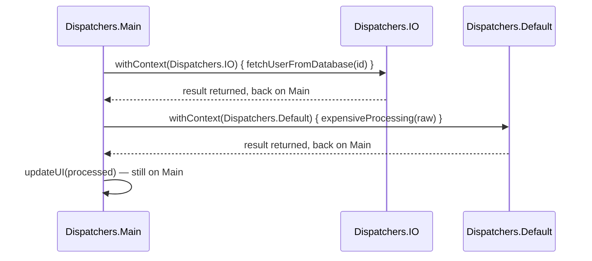

# Context Switching

A single coroutine can move between dispatchers mid-execution using `withContext` — the standard
way to do "a bit of CPU work, then a blocking call, then back to CPU work" all within one logical
coroutine, without launching separate coroutines for each part.

## `withContext` — switch, run, switch back

```kotlin
suspend fun loadAndProcessUser(id: Int): ProcessedUser = withContext(Dispatchers.Main) {
    val raw = withContext(Dispatchers.IO) {
        fetchUserFromDatabase(id)    // blocking call, correctly on Dispatchers.IO
    }
    val processed = withContext(Dispatchers.Default) {
        expensiveProcessing(raw)       // CPU-heavy work, correctly on Dispatchers.Default
    }
    updateUI(processed)                  // back on Dispatchers.Main automatically
    processed
}
```



Each `withContext` call suspends until its block completes, then resumes execution back on the
**original** dispatcher automatically — you don't have to manually track "which dispatcher was I
on before this" yourself.

## `withContext` vs. launching a new coroutine — a real distinction

```kotlin
// withContext: sequential, waits for the block, returns its result, same logical coroutine
val result = withContext(Dispatchers.IO) { fetchData() }

// launch: starts independent concurrent work, doesn't wait, no return value
launch(Dispatchers.IO) { fetchData() }
```

`withContext` is for "run this part of my sequential logic on a different dispatcher, then
continue" — it's still one coroutine, one linear flow, just executing different segments on
different thread pools. It is **not** a tool for concurrency — for actually running things at the
same time, see [Launch vs. Async](../01-basics/launch-vs-async.md).

## Why explicit dispatcher switching matters for correctness, not just performance

Calling a blocking function without switching to an appropriate dispatcher first doesn't just
hurt performance — on a dispatcher with a limited thread pool (like `Dispatchers.Default`, sized
to CPU cores), a blocking call can starve that pool entirely, preventing *other*, unrelated
coroutines from getting a thread to run on at all. See
[Blocking Calls in Coroutines](../06-common-pitfalls/blocking-calls-in-coroutines.md) for exactly
this failure mode in more depth.

## `withContext` and structured concurrency

`withContext` doesn't create a new independent coroutine outside the structured-concurrency tree
(see [Structured Concurrency Explained](../02-structured-concurrency/structured-concurrency-explained.md))
— it's still the same coroutine, temporarily running its next segment under a different context.
Cancelling the original coroutine cancels it regardless of which dispatcher a `withContext` block
happens to currently be running on.
