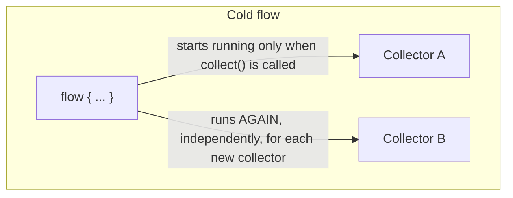
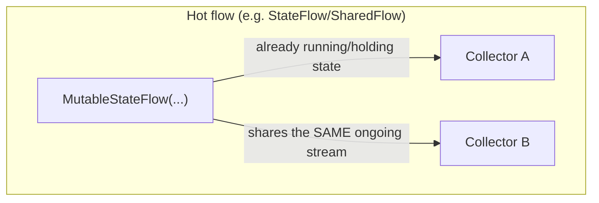

# Introduction to Flow

A `suspend fun` returns **one** value. `Flow<T>` is the coroutines-based answer to when you need
**multiple** values over time — an asynchronous stream, built on the same suspension mechanics
covered throughout this topic.

## Creating a flow

```kotlin
fun countDown(): Flow<Int> = flow {
    for (i in 3 downTo 1) {
        delay(1000L)
        emit(i)            // suspending — emits one value to whoever's collecting
    }
}
```

## Collecting a flow

```kotlin
suspend fun main() {
    countDown().collect { value ->
        println(value)
    }
}
// (waits 1s) 3
// (waits 1s) 2
// (waits 1s) 1
```

`collect` is itself a suspend function — collecting a flow doesn't block, it suspends until the
next value is emitted (or the flow completes).

## Cold vs. hot — the distinction that matters most





A **cold** flow (what `flow { }` builds) does nothing at all until `collect` is called — and runs
its whole body independently, from the start, for *each* separate collector. A **hot** flow (like
`StateFlow`/`SharedFlow` — see
[StateFlow & SharedFlow](./stateflow-and-sharedflow.md)) exists and potentially emits regardless of
whether anyone is collecting, and multiple collectors share the same ongoing stream rather than
each triggering an independent run.

```kotlin
val coldFlow = flow {
    println("Flow started")     // this line runs EVERY time collect() is called
    emit(1)
}

coldFlow.collect { }    // prints "Flow started"
coldFlow.collect { }    // prints "Flow started" AGAIN — independent run
```

## Flow vs. a suspend function returning a `List`

```kotlin
suspend fun fetchAllUsers(): List<User> { /* ... */ }    // waits for ALL results, then returns
fun streamUsers(): Flow<User> { /* ... */ }                // emits users one at a time, as ready
```

A `List`-returning suspend function makes you wait for **everything** before you get anything. A
`Flow` lets a consumer start reacting to the **first** item as soon as it's available, without
waiting for the rest — genuinely useful for large or slow-to-produce sequences (reading a large
file line by line, receiving paginated API results, listening to a stream of events over time)
rather than a fixed, fully-available-up-front collection.

## Flow builders, beyond `flow { }`

```kotlin
flowOf(1, 2, 3)                      // a flow of fixed known values
listOf(1, 2, 3).asFlow()               // convert an existing collection into a flow
```

## Where this fits

- [Flow Operators](./flow-operators.md) — transforming and combining flows, the same way you'd
  use `map`/`filter` on a regular collection, but suspending-aware.
- [StateFlow & SharedFlow](./stateflow-and-sharedflow.md) — the hot-flow variants, and when each
  is the right tool.
