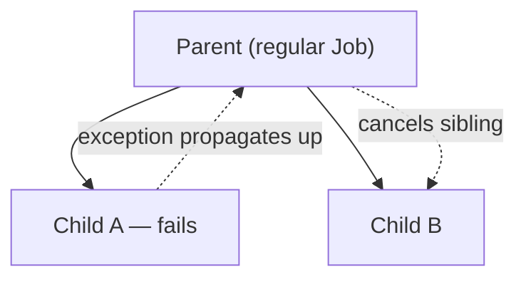
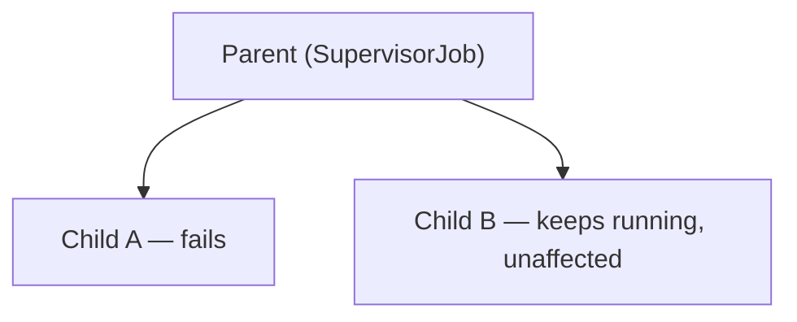

# Supervisor Jobs

The explicit opt-out from structured concurrency's default "fail together" behavior (see
[Structured Concurrency Explained](../02-structured-concurrency/structured-concurrency-explained.md)
and [Exception Handling in Coroutines](./exception-handling-in-coroutines.md)) — for the cases
where one child's failure genuinely shouldn't affect its siblings.

## The default behavior, as a reminder



With a regular `Job`, one child failing cancels the parent, which cancels every other child too.

## `SupervisorJob` — siblings fail independently



```kotlin
val scope = CoroutineScope(SupervisorJob() + Dispatchers.Default)

scope.launch {
    throw RuntimeException("Task A failed")   // does NOT cancel scope or Task B
}
scope.launch {
    delay(1000L)
    println("Task B still completes normally")
}
```

A `SupervisorJob` changes the propagation rule specifically for **its own direct children** —
one failing doesn't cancel the others, and doesn't cancel the supervisor scope itself.

## `supervisorScope` — the structured, scoped version

```kotlin
suspend fun runIndependentTasks() = supervisorScope {
    launch {
        throw RuntimeException("Task A failed")   // doesn't affect Task B
    }
    launch {
        delay(1000L)
        println("Task B still completes")
    }
}
```

`supervisorScope` is the suspend-function equivalent of manually building a `CoroutineScope` with
a `SupervisorJob` — preferred in most code, since it stays properly structured (bound to the
calling coroutine's own lifetime) rather than requiring a separately, manually-managed scope.

## When this is actually the right choice

```text
Good fit for SupervisorJob:
  - A UI screen with several independent widgets, each loading its own data —
    one widget's data failing to load shouldn't blank out the whole screen
  - Processing a batch of independent items where one item's failure shouldn't
    abort processing the rest
  - A set of unrelated background tasks started together for convenience, with
    no actual dependency between their outcomes

Poor fit (stick with regular structured concurrency):
  - Steps that genuinely depend on each other's success (fetch data, THEN process it —
    processing without valid data isn't meaningful)
  - Anything where "partial success" isn't actually a valid, safe state to be in
```

## A common mistake: applying `SupervisorJob` too broadly

```kotlin
// ❌ supervisorScope wrapping steps that actually depend on each other
supervisorScope {
    val user = async { fetchUser(id) }         // if this fails...
    val orders = async { fetchOrders(user.await().id) }   // ...this fails anyway, just less
                                                              //    predictably, and other
                                                              //    "independent" siblings keep
                                                              //    running pointlessly
}
```

`SupervisorJob`/`supervisorScope` is a deliberate exception to structured concurrency's default,
not a general-purpose way to avoid thinking about failure propagation — reach for it specifically
when sibling coroutines' outcomes are genuinely independent of each other, not as a default
habit.
