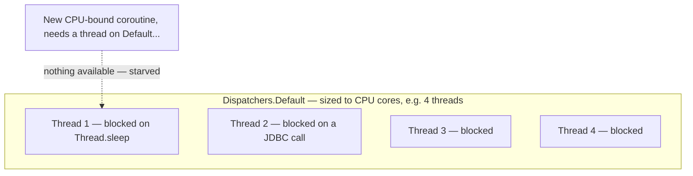

# Blocking Calls in Coroutines

Common enough, and disruptive enough, to deserve its own page: calling a genuinely **blocking**
function from inside a coroutine without routing it through an appropriate dispatcher first.

## The mistake

```kotlin
❌ launch(Dispatchers.Default) {
    Thread.sleep(5000L)         // BLOCKS the actual thread — defeats the whole point
    val data = jdbcConnection.executeQuery(sql)    // blocking JDBC call, also on Default
}
```

`Thread.sleep` and a blocking JDBC driver call don't suspend — they genuinely occupy and block
the underlying OS thread for their entire duration, exactly like they would outside any coroutine
at all. Coroutines don't magically make a blocking call non-blocking.

## Why this is worse than it looks — thread pool starvation



`Dispatchers.Default` has a limited thread pool, deliberately sized to the number of CPU cores —
it's meant for CPU-bound work that actually needs to run concurrently with other CPU-bound work,
not for waiting. Enough blocking calls running on it can exhaust the entire pool, starving
**every other** coroutine — including completely unrelated ones — that needs a thread from
`Default` to make progress.

## The fix: `Dispatchers.IO`, or `withContext` around just the blocking part

```kotlin
✅ launch(Dispatchers.Default) {
    val processed = expensiveComputation(input)     // genuinely CPU-bound — fine on Default

    val data = withContext(Dispatchers.IO) {
        jdbcConnection.executeQuery(sql)               // blocking call, correctly isolated to IO
    }
}
```

`Dispatchers.IO` is deliberately sized much larger than `Default` (see
[Dispatchers](../03-dispatchers-and-threading/dispatchers.md)), specifically to absorb many
concurrent blocking calls without starving CPU-bound work elsewhere. `withContext(Dispatchers.IO)`
around just the blocking portion — not the whole coroutine — keeps the rest of the coroutine free
to run wherever it started.

## `delay()` is not the same as `Thread.sleep()` — a related but different point

```kotlin
❌ launch { Thread.sleep(1000L) }    // blocks the thread for 1 second
✅ launch { delay(1000L) }             // suspends for 1 second, thread is free to do other work
```

`delay` is a genuine suspending function — it doesn't block anything. `Thread.sleep` inside a
coroutine is a blocking call like any other, subject to the exact same thread-starvation concern
covered above, even though the *intent* (pause for some duration) looks identical.

## Recognizing a blocking call in a library you didn't write

Not always obvious from a function signature alone — a library function with no `suspend` modifier
that does I/O (a database driver without coroutine support, a synchronous HTTP client, file
reading via plain `java.io`) is very likely blocking under the hood, even if nothing about calling
it looks different from calling any other regular function.

```text
Rule of thumb: if a function isn't marked `suspend` AND it does I/O (network, disk, database),
assume it blocks the calling thread, and wrap it in withContext(Dispatchers.IO).
```

## Why this is listed as a "pitfall" and not just a Dispatchers detail

This specific mistake is singled out because its symptoms are often confusing and indirect — an
app doesn't crash, it just becomes mysteriously slow or unresponsive under load, with the actual
cause (a starved dispatcher thread pool) several steps removed from wherever the slowdown is
actually *observed*.
