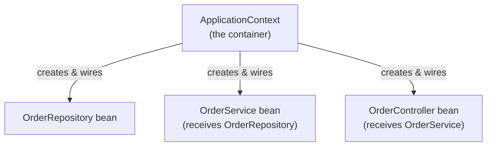

# DI Basics in Spring

## What dependency injection actually solves

A class that needs a collaborator (a service needing a repository, a controller needing a
service) has two ways to get it: **create it itself**, or **have it handed to it** from outside.
Dependency injection is the second approach, systematized.

```kotlin title="❌ The class creates its own dependency"
class OrderService {
    private val repository = OrderRepository()    // hardcoded, can't be swapped or mocked
}
```

```kotlin title="✅ The dependency is handed in"
class OrderService(private val repository: OrderRepository)
```

The second version doesn't know or care *how* `OrderRepository` was constructed — a real one, a
fake one for testing, a different implementation entirely. This is the whole point: **decoupling
what a class needs from how that need gets fulfilled.**

## The `ApplicationContext` — Spring's container

Spring's DI container (the `ApplicationContext`) is responsible for:

1. **Discovering** classes marked as Spring-managed (`@Component`, `@Service`, `@Repository`,
   `@RestController`, and others — see [Beans & Scopes](./beans-and-scopes.md)).
2. **Constructing** instances of them (these instances are called **beans**).
3. **Wiring** them together — if `OrderService` needs an `OrderRepository`, the container finds
   (or creates) an `OrderRepository` bean and passes it in automatically.



You never write `OrderService(OrderRepository())` yourself anywhere in application code — the
container does this wiring automatically, based on what each bean's constructor declares it
needs.

## Why this matters beyond "less boilerplate"

- **Testability** — swap a real dependency for a test double without changing the class under
  test at all (see [Unit Testing with MockK](../05-testing-spring-apps/unit-testing-with-mockk.md)).
- **Single Responsibility** — a class focused on its own logic doesn't also need to know how to
  construct its collaborators.
- **Centralized configuration** — which concrete implementation gets used (see
  [Configuration & Profiles](../01-basics/configuration-and-profiles.md)'s profile-specific beans
  example) is decided in one place, not scattered across every place a dependency is constructed.

## Three ways to inject in Spring, briefly

```kotlin
// Constructor injection — the recommended default, see the next page
class OrderService(private val repository: OrderRepository)

// Field injection — works, but generally discouraged
class OrderService {
    @Autowired
    private lateinit var repository: OrderRepository
}

// Setter injection — rare in practice
class OrderService {
    private lateinit var repository: OrderRepository
    @Autowired
    fun setRepository(repository: OrderRepository) { this.repository = repository }
}
```

[Constructor Injection, Kotlin Style](./constructor-injection-kotlin-style.md) covers exactly why
constructor injection is the strong default recommendation, and why it's an especially natural fit
for Kotlin specifically.
