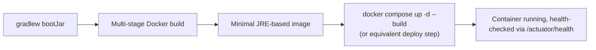

# Packaging & Deploying a Spring Boot App

Ties this whole topic to the [Docker](/study-materials/docker/basics/what-is-a-container) topic — building a Spring Boot app
into a container image follows the exact same principles covered there, applied to this specific
stack.

## The build artifact — a fat JAR

```bash
./gradlew bootJar
```

Produces a single executable JAR containing the app's compiled code **and every dependency**
bundled inside it — runnable directly with `java -jar app.jar`, no separate classpath setup
needed. This is what actually gets copied into the final container image stage below.

## A multi-stage Dockerfile

```dockerfile title="Dockerfile"
# Stage 1: build with the full JDK
FROM eclipse-temurin:21-jdk AS builder
WORKDIR /app
COPY . .
RUN ./gradlew bootJar --no-daemon

# Stage 2: run with only a JRE, much smaller
FROM eclipse-temurin:21-jre-alpine
WORKDIR /app
COPY --from=builder /app/build/libs/*.jar app.jar
EXPOSE 8080
CMD ["java", "-jar", "app.jar"]
```

This is a direct application of
[Dockerfile Best Practices](/study-materials/docker/production-practices/dockerfile-best-practices)'
multi-stage build pattern from the Docker topic: the full **JDK** (compiler, build tools) is only
needed to *produce* the JAR; running it only needs a **JRE** (no compiler at all) — a meaningfully
smaller final image, with the entire Gradle build toolchain and dependency cache left behind in
the discarded `builder` stage.

## Layered JARs — an even more cache-friendly approach

```dockerfile
FROM eclipse-temurin:21-jdk AS builder
WORKDIR /app
COPY . .
RUN ./gradlew bootJar --no-daemon
RUN java -Djarmode=layertools -jar build/libs/*.jar extract

FROM eclipse-temurin:21-jre-alpine
WORKDIR /app
COPY --from=builder /app/dependencies/ ./
COPY --from=builder /app/spring-boot-loader/ ./
COPY --from=builder /app/snapshot-dependencies/ ./
COPY --from=builder /app/application/ ./
ENTRYPOINT ["java", "org.springframework.boot.loader.launch.JarLauncher"]
```

Spring Boot's layered JAR feature splits the fat JAR into separate layers by how often each
changes — dependencies (rarely), then application code (often). This is the same
[image layer caching](/study-materials/docker/images-and-dockerfiles/image-layers-and-caching)
principle from the Docker topic applied specifically to a Spring Boot JAR: a code-only change
only invalidates the final, small `application` layer, not the entire multi-hundred-megabyte
dependency layer, meaningfully speeding up rebuilds and registry pushes.

## Configuration at runtime, via environment variables

```dockerfile
ENV SPRING_PROFILES_ACTIVE=prod
```

```bash
docker run -e SPRING_PROFILES_ACTIVE=prod -e SPRING_DATASOURCE_PASSWORD=secret my-app
```

Spring Boot automatically maps environment variables to configuration properties (
`SPRING_DATASOURCE_PASSWORD` → `spring.datasource.password`) — the same
[environment variable configuration pattern](/study-materials/docker/running-containers/environment-and-secrets)
covered in the Docker topic, letting the same image run against dev/staging/prod
[profiles](../01-basics/configuration-and-profiles.md) without rebuilding it per environment. As
covered there, a real secret like a database password belongs in a proper secrets mechanism at
deploy time, not baked into the image or committed anywhere.

## Health check integration

```dockerfile
HEALTHCHECK --interval=30s --timeout=3s --retries=3 \
  CMD curl -f http://localhost:8080/actuator/health || exit 1
```

Ties directly to [Actuator & Observability](./actuator-and-observability.md) covered earlier in
this section — the exact health endpoint Actuator provides is what a container's own health check
should call, closing the loop between "the app reports itself healthy" and "the container runtime
knows to route traffic to it or restart it."

## The full picture



Every step here reuses a concept already covered in depth elsewhere — this page is specifically
the connective tissue showing how Kotlin+Spring Boot's own build output (`bootJar`) slots into the
general containerization and deployment practices covered fully in the
[Docker](/study-materials/docker/basics/what-is-a-container) topic, rather than duplicating that material.
