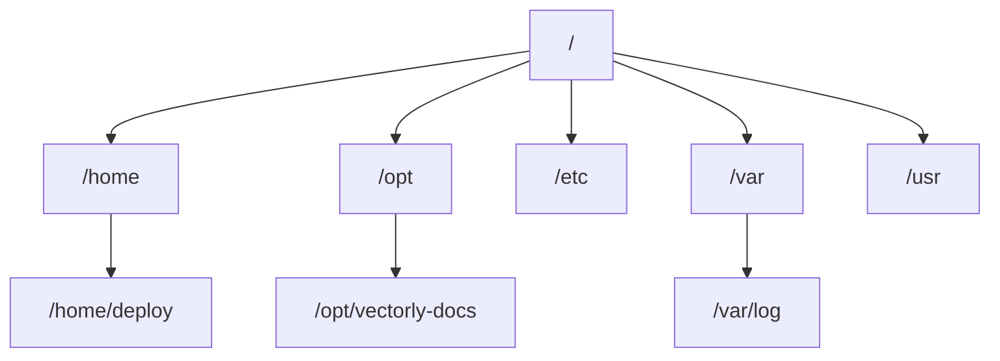

# The Filesystem

Linux has **one** filesystem tree, rooted at `/` — unlike Windows' `C:\`, `D:\` per-drive letters,
everything (including other disks, network shares, USB drives) gets *mounted* somewhere into this
same single tree.



## Key directories

| Path | What lives there |
|---|---|
| `/home/<user>` | Each user's personal files, config, `~` shortcuts here |
| `/opt` | Third-party / self-installed applications — this is where `/opt/vectorly-docs` and `/opt/vectorly-main-site` live on this org's VPS |
| `/etc` | System-wide configuration files |
| `/var` | Variable data — logs (`/var/log`), caches, things that change while the system runs |
| `/usr` | Installed programs and their supporting files (most of what a package manager installs) |
| `/tmp` | Temporary files, often cleared on reboot |

## Absolute vs. relative paths

```bash
/opt/vectorly-docs/docs/README.md      # absolute — always starts from /, unambiguous from anywhere
docs/README.md                          # relative — depends on your current directory
../vectorly-site/package.json            # relative, ".." means "up one level"
```

`~` is shorthand for your home directory (`/home/deploy` for a user named `deploy`) — `cd ~` and
`cd` (no argument) both take you home.

## `pwd` — where am I right now

```bash
pwd
# /opt/vectorly-docs
```

The shell always has a "current working directory" — every relative path is interpreted starting
from there. This is the single most useful command when a relative path isn't behaving as
expected.

## Hidden files

Any file/folder starting with `.` is hidden from a plain `ls`:

```bash
ls              # won't show .bashrc, .ssh, .env, .gitignore, etc.
ls -a           # shows everything, including hidden files
```

This isn't a permission or security mechanism — just a convention to keep config/dotfiles out of
normal directory listings. `.ssh/`, `.bashrc`, `.gitconfig` are all hidden this way.

## Everything is a file

A Linux philosophy worth knowing even at a basics level: devices, sockets, and process information
are all exposed *as if* they were files too (`/dev/sda` for a disk, `/proc/1234` for process 1234)
— the same tools (`cat`, `ls`, redirection) work on them as on ordinary files, which is why so much
of Linux administration is just "reading and writing files" even when the underlying thing isn't
really a document.
