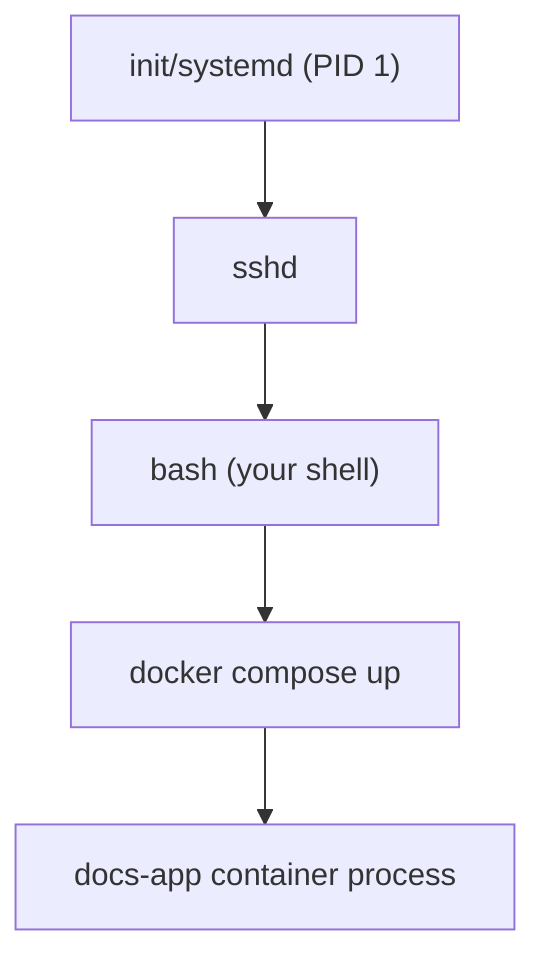

# What Is a Process

A **process** is a running instance of a program — the same program (e.g. `bash`, `node`) can be
running as multiple separate processes at once, each with its own memory, its own state, and its
own **PID** (process ID).

## Parent and child processes

Every process (except the very first one at boot) is started *by* another process — its parent.
Running a command from your shell makes your shell the parent of a new child process:



This is why closing a terminal can kill everything you started from it (its children) unless you
deliberately detach them — see
[Background & Jobs](./background-and-jobs.md).

## PIDs and exit codes

```bash
echo $$          # PID of your current shell
```

Every process, when it finishes, returns an **exit code** — `0` means success, anything else means
some kind of failure (the specific nonzero value's meaning is defined by that program).

```bash
ls /nonexistent
echo $?            # prints the exit code of the LAST command — nonzero here, since ls failed
```

`$?` is how scripts check "did the previous command actually succeed" — the backbone of
[Shell Scripting Basics](../06-practical-shell/shell-scripting-basics.md)' error handling.

## Process states, briefly

A process is generally in one of: **running** (actively using CPU), **sleeping** (waiting on
something — disk I/O, network, user input — not using CPU), or **zombie** (finished, but its exit
status hasn't been collected by its parent yet — normally cleans up quickly, a pile of zombies
usually signals a bug in the parent process).

## Why this matters day to day

Understanding "a process has a parent, a PID, and an exit code" is what makes the next two pages —
[Managing Processes](./managing-processes.md) and
[Background & Jobs](./background-and-jobs.md) — make sense as more than a list of commands to
memorize.
