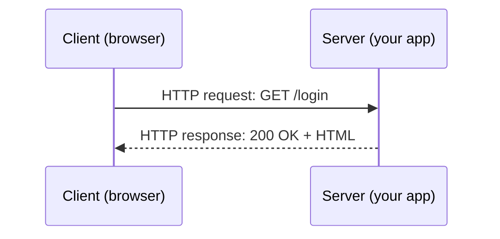

# What Is a Server

A **server** is just a program listening for connections on a network — waiting for something to
ask it for data, and responding. A **client** is whatever initiates that connection: a browser, a
mobile app, `curl`, another server.



"Server" describes a *role*, not a type of machine. The same physical computer can run multiple
servers (a web server, a database server, an SSH server) simultaneously, each listening on its own
**port** — see [Ports & Protocols](./ports-and-protocols.md).

## Localhost vs. remote

- `localhost` (or `127.0.0.1`) always means "this machine" — a server running on your own laptop,
  reachable only from your own laptop (unless you deliberately expose it).
- A **remote** server runs on a different machine — reached over a network by its IP address or,
  more usually, a domain name that resolves to that IP (see
  [How DNS Works](../03-domains-and-dns/how-dns-works.md)).

```bash
curl http://localhost:3000        # talking to a server on your own machine
curl https://docs.vectorly-slovakia.sk    # talking to a remote server
```

## Where this org's servers live

Concretely: `docs.vectorly-slovakia.sk` is a Docusaurus site running in a Docker container on a
remote VPS (see
[`/internal-operations/server-architecture`](/internal-operations/server-architecture)) — a
reverse proxy (Caddy) in front of it decides which container handles a request based on the
domain name. [Web Serving](../04-web-serving/reverse-proxies.md) covers how that routing works,
[SSH](../02-ssh/ssh-basics.md) covers how you get a terminal on that remote machine to manage it.

## Client-server vs. peer-to-peer

Almost everything covered in this section is **client-server**: one side offers a service, the
other consumes it, and the roles are fixed. (Peer-to-peer, where every node can act as both,
exists too — BitTorrent, some blockchain networks — but is out of scope here; nothing in this
org's stack works that way.)

## Check yourself

- Is "server" a type of machine, or a role a program plays? Why does that distinction matter for
  one physical computer running multiple servers at once?

  <details>
  <summary>Answer</summary>

  It's a role, not a machine type — the same physical computer can run a web server, a database
  server, and an SSH server simultaneously, each just a program listening on its own port.
  </details>

- Does `curl http://localhost:3000` reach a server on your own machine, or on some remote server?

  <details>
  <summary>Answer</summary>

  Your own machine — `localhost`/`127.0.0.1` always means "this machine," reachable only from
  itself unless deliberately exposed.
  </details>

- Concretely, how does a request for `docs.vectorly-slovakia.sk` end up at the right container on
  this org's VPS?

  <details>
  <summary>Answer</summary>

  A reverse proxy (Caddy) in front of the VPS receives the request and decides which container
  handles it based on the domain name in the request.
  </details>

