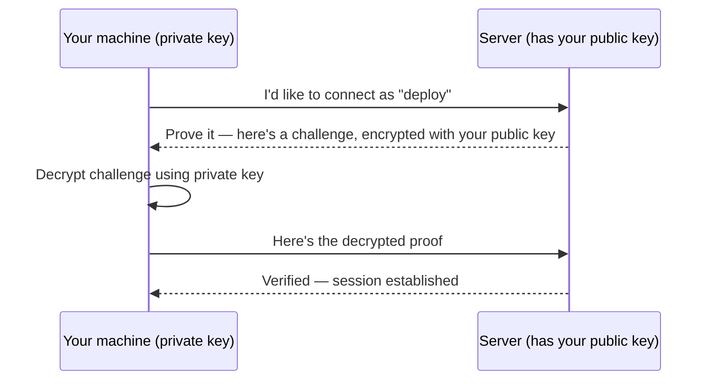

# SSH Keys

An SSH keypair is two mathematically linked files: a **private key** (never shared, proves your
identity) and a **public key** (shared freely, placed on servers you want to access).

## Generating a keypair

```bash
ssh-keygen -t ed25519 -C "you@example.com"
```

Creates two files by default:

```
~/.ssh/id_ed25519        <- private key, NEVER share this, never commit it
~/.ssh/id_ed25519.pub     <- public key, safe to share/paste anywhere
```

`ed25519` is the modern recommended key type — smaller and faster than the older `rsa`, with no
real downside for typical use.

## How authentication actually works



Your private key never leaves your machine, even during authentication — the server only ever
sees the public key and the proof that you hold the matching private one.

## Getting your public key onto a server

```bash
ssh-copy-id user@server                       # easiest, if password auth is still enabled
# or manually:
cat ~/.ssh/id_ed25519.pub | ssh user@server "cat >> ~/.ssh/authorized_keys"
```

The server checks incoming connections against everything listed in
`~/.ssh/authorized_keys` for that user — any key listed there is allowed in.

## Passphrases

```bash
ssh-keygen -t ed25519 -C "you@example.com"
# Enter passphrase (empty for no passphrase): ****
```

A passphrase encrypts the private key file itself at rest — even if the file leaks (stolen laptop,
backup mistake), it's useless without the passphrase too. Use `ssh-agent` to unlock it once per
session instead of retyping it every connection:

```bash
eval "$(ssh-agent -s)"
ssh-add ~/.ssh/id_ed25519
```

:::warning
A private key with no passphrase, on a machine that gets compromised, hands over full access to
everything that key can reach — no second factor to slow an attacker down. Deploy keys (like this
repo's CI key — see
[`/internal-operations/git-workflow`](/internal-operations/git-workflow)) are a deliberate
exception: they're passphrase-less because CI can't type one, which is exactly why they're scoped
narrowly (one key, one purpose) instead of reusing a personal key.
:::

## One key per purpose

Generate separate keypairs for separate concerns (personal GitHub access vs. a deploy key vs. a
specific server) rather than reusing one key everywhere — see
[SSH Config](./ssh-config.md) for managing several keys cleanly.

## Check yourself

- Which half of an SSH keypair should ever leave your machine, even during authentication?

  <details>
  <summary>Answer</summary>

  Neither, really — the private key never leaves your machine at all. The server only ever sees
  the public key and proof (a decrypted challenge) that you hold the matching private key.
  </details>

- What does a passphrase actually protect against, given the private key file itself might leak
  (stolen laptop, backup mistake)?

  <details>
  <summary>Answer</summary>

  It encrypts the private key file at rest, so a leaked file is useless to whoever has it without
  also knowing the passphrase.
  </details>

- Why are CI deploy keys (like this repo's `vectorly_docs_key`) deliberately passphrase-less,
  when that seems to contradict the passphrase advice above?

  <details>
  <summary>Answer</summary>

  CI has no human to type a passphrase — the tradeoff is accepted specifically because the key is
  scoped narrowly (one key, one purpose) instead of reusing a broader personal key.
  </details>

