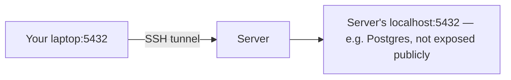

# SSH Tunneling

An SSH connection can carry more than a terminal — it can forward arbitrary network traffic
through an encrypted tunnel, useful for reaching something that isn't (and shouldn't be) exposed
directly to the internet.

## Local port forwarding (`-L`)

Reach a service on the **remote** side (or something only the remote can see) as if it were on
your own machine.

```bash
ssh -L 5432:localhost:5432 deploy@docs.vectorly-slovakia.sk
```



Now connecting to `localhost:5432` on **your** machine actually reaches Postgres running on the
server, without that database ever needing a public port open. Classic use case: a database that's
firewalled off from the internet on purpose, but you need a GUI client on your laptop to inspect
it.

## Remote port forwarding (`-R`)

The reverse — expose something on **your** machine to the remote server.

```bash
ssh -R 8080:localhost:3000 deploy@docs.vectorly-slovakia.sk
```

Now something on the server hitting its own `localhost:8080` actually reaches port 3000 on your
laptop. Less common day-to-day; useful for letting a remote machine briefly reach a dev server
running locally (e.g. a webhook testing setup).

## Dynamic forwarding / SOCKS proxy (`-D`)

```bash
ssh -D 1080 deploy@docs.vectorly-slovakia.sk
```

Turns the SSH connection into a general-purpose SOCKS proxy — point a browser or `curl` at
`localhost:1080` and *all* its traffic routes through the remote server, not just one port.
Useful for browsing as if you were "at" that server's network/location.

```bash
curl -x socks5h://localhost:1080 https://example.com
```

## Keeping a tunnel running in the background

```bash
ssh -f -N -L 5432:localhost:5432 deploy@docs.vectorly-slovakia.sk
```

`-N` = don't run a remote command, just forward. `-f` = background the process after connecting.
Kill it later with `ssh -O exit` (with a matching `ControlPath` set up) or just find and kill the
process.

## When to reach for this vs. a VPN

A tunnel is a single-purpose, per-connection workaround — quick to set up, no infrastructure
needed. A VPN is the right call when the *same* need recurs across a whole team or many services;
a tunnel is right for "I need to poke at this one thing right now."

## Check yourself

- With `ssh -L 5432:localhost:5432 deploy@host`, which machine's port 5432 do you actually reach
  when you connect to `localhost:5432` on your own laptop?

  <details>
  <summary>Answer</summary>

  The remote server's port 5432 — local forwarding (`-L`) makes a service on the remote side
  reachable as if it were running on your own machine.
  </details>

- What's the difference between what `-L` and `-D` actually forward — one specific port, or
  everything?

  <details>
  <summary>Answer</summary>

  `-L` forwards one specific port to one specific destination; `-D` turns the whole SSH connection
  into a general-purpose SOCKS proxy, routing all of a client's traffic through the remote server.
  </details>

- Why reach for a tunnel instead of a VPN for "I need to inspect this one firewalled database
  right now"?

  <details>
  <summary>Answer</summary>

  A tunnel is quick to set up with no infrastructure needed for a single-purpose, per-connection
  need; a VPN is worth the setup only when the same access need recurs across a whole team or many
  services.
  </details>

