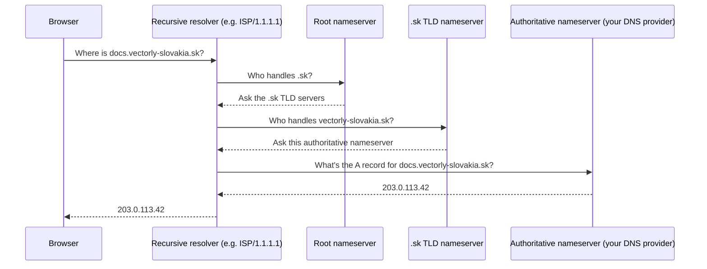

# How DNS Works

**DNS** (Domain Name System) translates a human-readable domain (`docs.vectorly-slovakia.sk`)
into an IP address a computer can actually route packets to. Without it, you'd have to remember
and type raw IP addresses for everything.

## Registrars vs. nameservers — two different jobs

- **Registrar** — where you *bought* the domain (e.g. Namecheap, GoDaddy). Handles ownership,
  renewal, and points the domain at a set of nameservers.
- **Nameservers** — the servers that actually answer "what's the IP for this domain" queries.
  Often run by a DNS provider (Cloudflare, the registrar itself, or your hosting provider) — this
  is where the actual DNS records (see [DNS Records](./dns-records.md)) live and get edited.

A domain's registrar and its DNS provider are commonly different companies — the registrar just
needs to know *which* nameservers to point to; everything else happens there.

## Resolution flow



In practice most of this is cached at every level, so it rarely happens in full for a domain
that's been resolved recently anywhere on your network — this is the "cold start" path.

## Caching and TTL

Every DNS record has a **TTL** (time to live) — how long a resolver is allowed to cache the
answer before asking again. Set it low (e.g. 300 seconds) before a planned DNS change so the
change propagates quickly; a long-standing record with a high TTL (e.g. 86400 = 24h) reduces load
on the nameserver but means changes take longer to take effect everywhere.

## Checking DNS yourself

```bash
dig docs.vectorly-slovakia.sk           # detailed query + answer
dig docs.vectorly-slovakia.sk +short     # just the IP
nslookup docs.vectorly-slovakia.sk        # alternative, more available by default on Windows
```

More on reading these results in
[Troubleshooting Connectivity](../05-practical-setups/troubleshooting-connectivity.md).

## Check yourself

- Are the registrar and the DNS provider always the same company? What does each one actually do?

  <details>
  <summary>Answer</summary>

  Not necessarily — the registrar is where you bought the domain and handles ownership/renewal,
  pointing it at a set of nameservers; the nameservers (often a different company) are where the
  actual DNS records live and get edited.
  </details>

- Why does changing a record's TTL to a low value (e.g. 300 seconds) before a planned DNS change
  help, and what's the tradeoff of leaving it low permanently?

  <details>
  <summary>Answer</summary>

  A low TTL makes resolvers ask again sooner, so a change propagates faster. Left low permanently,
  it means more repeated queries hitting the nameserver — a high TTL reduces that load but makes
  future changes slower to take effect.
  </details>

- In the resolution flow diagram, does a browser normally ask the root nameserver directly for
  every single lookup?

  <details>
  <summary>Answer</summary>

  No — in practice, most of this is cached at every level, so the full root → TLD → authoritative
  chain only happens on a "cold start" for a domain not recently resolved anywhere on the network.
  </details>

