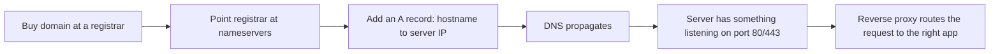

# Pointing a Domain at a Server

Putting the previous two pages together: the practical steps to get a domain name actually
serving a running app.

## The chain



Each box is a separate page in this section — this page is just the checklist tying them
together.

## Step by step

1. **Register the domain** with a registrar (see [How DNS Works](./how-dns-works.md) for the
   registrar/nameserver split).
2. **Add an `A` record** pointing the hostname at your server's public IP (see
   [DNS Records](./dns-records.md)):
   ```
   A   docs.vectorly-slovakia.sk   → 203.0.113.42
   ```
3. **Wait for propagation** — check with `dig docs.vectorly-slovakia.sk +short` until it returns
   the right IP everywhere you test from.
4. **Make sure something is listening** on the server at ports 80/443 — see
   [Ports & Protocols](../01-basics/ports-and-protocols.md) and
   [SSH Basics](../02-ssh/ssh-basics.md) for getting onto the server to check.
5. **Set up a reverse proxy** (e.g. Caddy, nginx) on the server to route the incoming request by
   hostname to the right app/container, and handle TLS — see
   [Reverse Proxies](../04-web-serving/reverse-proxies.md) and
   [TLS & HTTPS](../04-web-serving/tls-https.md).

## Verifying each link independently

When "the domain doesn't work," check the chain in order rather than guessing:

```bash
dig docs.vectorly-slovakia.sk +short         # DNS resolving to the right IP at all?
curl -v http://203.0.113.42                    # server reachable directly by IP?
curl -v https://docs.vectorly-slovakia.sk       # full chain, including the reverse proxy + TLS?
```

If the IP check works but the hostname doesn't: DNS problem. If neither works: the server or
firewall. If the IP works over `http://` but the domain fails over `https://`: reverse proxy/TLS
config specifically. See
[Troubleshooting Connectivity](../05-practical-setups/troubleshooting-connectivity.md) for more of
this diagnostic approach.

## How this org does it

`docs.vectorly-slovakia.sk` follows exactly this chain onto the Netcup VPS described in
[`/internal-operations/server-architecture`](/internal-operations/server-architecture) — DNS
pointed at the VPS, Caddy as the reverse proxy handling TLS and routing by hostname to the right
Docker container.

## Check yourself

- A domain resolves to the right IP via `dig`, but `curl -v https://the-domain` fails while
  `curl -v http://the-ip` succeeds. Where's the problem, per this page's diagnostic order?

  <details>
  <summary>Answer</summary>

  Specifically the reverse proxy/TLS configuration — DNS and the server itself are both fine since
  the IP check over plain HTTP worked.
  </details>

- Why check `dig ... +short` before trying `curl` against the domain at all?

  <details>
  <summary>Answer</summary>

  It isolates whether DNS is even resolving to the right IP first — no point debugging the server
  or reverse proxy if the domain isn't pointing at the right place yet.
  </details>

- What has to be true on the server itself before a reverse proxy can even be useful, per the
  chain on this page?

  <details>
  <summary>Answer</summary>

  Something has to actually be listening on ports 80/443 on the server — the reverse proxy routes
  incoming requests, it doesn't create a listener where none exists.
  </details>

