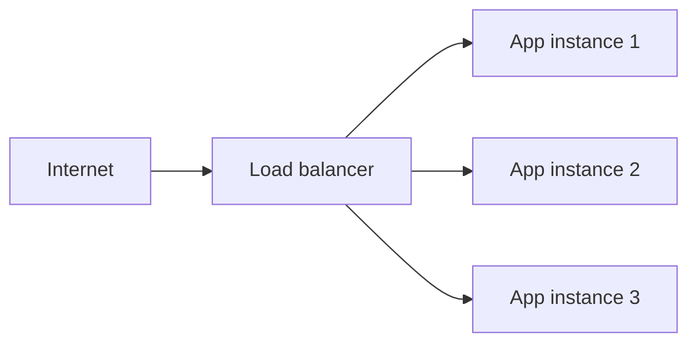
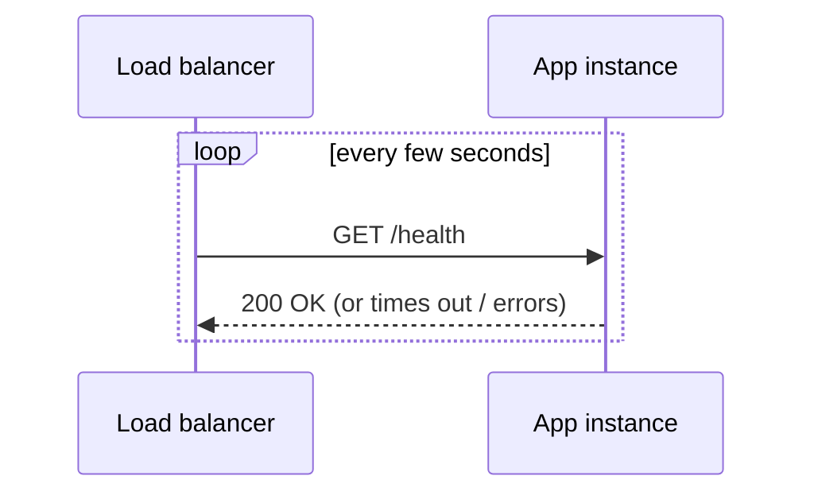

# Load Balancing Basics

A load balancer spreads incoming requests across **multiple** instances of the same backend,
instead of one reverse-proxy target handling everything alone. Same underlying mechanism as a
reverse proxy (see [Reverse Proxies](./reverse-proxies.md)) — routing decisions — just routing
across replicas of one service rather than to different services.

## Why

- **Capacity** — one instance has a ceiling on how much traffic it can handle; more instances
  raise that ceiling.
- **Availability** — if one instance crashes or is being deployed/restarted, the others keep
  serving traffic. This is what makes zero-downtime deploys possible.

## Common strategies

| Strategy | How it picks an instance |
|---|---|
| Round robin | Cycles through instances in order, one request each |
| Least connections | Sends to whichever instance currently has the fewest active requests |
| IP hash | Same client IP always routes to the same instance (useful for session affinity) |

## Health checks

A load balancer needs to know when an instance is actually broken, not just route to it blindly:

An instance that stops responding to health checks gets pulled out of rotation automatically until
it recovers — this is what lets a rolling deploy replace instances one at a time with zero
requests ever hitting a dead one.

## Where this applies (and doesn't) here

This org's current setup — one VPS, one container per app (see
[`/internal-operations/server-architecture`](/internal-operations/server-architecture)) — doesn't
run multiple replicas of the docs site, so there's no load balancer in the picture today; Caddy is
acting purely as a reverse proxy routing by hostname, not spreading load across instances. This
page is here as the concept you'd reach for if/when traffic or availability needs outgrow a single
instance — not a description of the current setup.
