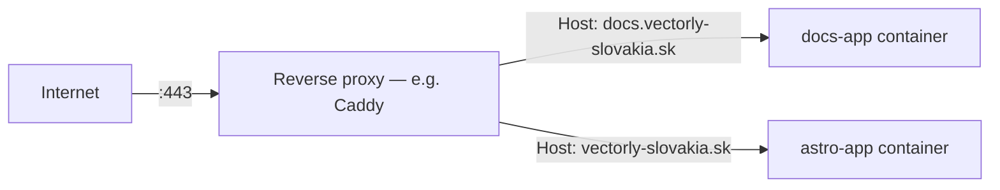

# Reverse Proxies

A **reverse proxy** sits in front of one or more backend servers, receives all incoming traffic
first, and decides which backend actually handles each request. Callers only ever talk to the
proxy — they never connect to the backend directly.



## Why put one in front of your app at all

- **Routing by hostname** — one server, one public IP, many domains/subdomains, each routed to a
  different backend. This is exactly how `docs.vectorly-slovakia.sk` and `vectorly-slovakia.sk`
  share the same VPS but reach different containers.
- **TLS termination** — the proxy handles HTTPS certificates once, centrally; backend apps can
  speak plain HTTP internally (see [TLS & HTTPS](./tls-https.md)).
- **A single, controlled entry point** — backends don't need to be reachable from the internet at
  all, only the proxy does, which shrinks what needs securing/patched against direct exposure.
- Also commonly handles: compression, caching, rate limiting, load balancing across multiple
  backend instances (see [Load Balancing Basics](./load-balancing-basics.md)).

## A minimal Caddy example

```caddyfile title="Caddyfile"
docs.vectorly-slovakia.sk {
    reverse_proxy docs-app:80
}

vectorly-slovakia.sk, www.vectorly-slovakia.sk {
    reverse_proxy astro-app:80
}
```

Caddy reads the `Host` header on each incoming request, matches it against these blocks, and
forwards to the named backend — `docs-app:80` here is a Docker container name + port, reachable
because both containers sit on the same Docker network (`proxy-net` in this org's setup — see
[`/internal-operations/server-architecture`](/internal-operations/server-architecture)).

## Reverse proxy vs. forward proxy

Easy to mix up:

- **Reverse proxy** — sits in front of *servers*, hides which backend served a request. The client
  doesn't know or care which backend answered.
- **Forward proxy** — sits in front of *clients*, hides which client made a request (e.g. a
  corporate proxy, or the SOCKS proxy from [SSH Tunneling](../02-ssh/ssh-tunneling.md)). The
  server doesn't know which real client is asking.

## Basic auth at the proxy layer

A reverse proxy can also gate access before a request ever reaches the app — this is how this
docs site itself is protected:

```caddyfile
docs.vectorly-slovakia.sk {
    basicauth /* {
        bnovak <bcrypt-hash>
    }
    reverse_proxy docs-app:80
}
```

The app itself has zero awareness of auth — Caddy rejects unauthenticated requests before they
ever reach `docs-app`.
