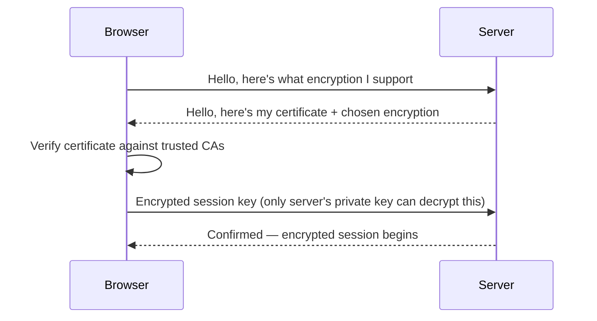
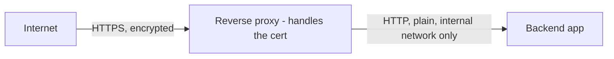

# TLS & HTTPS

**HTTPS** is HTTP run over **TLS** (Transport Layer Security) — the same requests and responses,
but encrypted in transit, plus proof that you're talking to the server you think you are.

## What TLS actually buys you

- **Encryption** — anyone intercepting the traffic (a coffee-shop Wi-Fi, an ISP, a
  man-in-the-middle) sees scrambled bytes, not your login form's contents.
- **Authentication** — a certificate, issued by a trusted Certificate Authority (CA), proves the
  server is who it claims to be. Without this, encryption alone wouldn't stop someone from
  impersonating the real server.
- **Integrity** — tampering with data in transit is detectable, not just invisible.

## The handshake, simplified



After this handshake, all subsequent HTTP traffic on the connection is encrypted using the
negotiated session key — the certificate/CA step only happens once per connection, not per
request.

## Certificates and Let's Encrypt / ACME

A certificate is issued by a CA and needs periodic renewal (typically every 90 days for
[Let's Encrypt](https://letsencrypt.org/) certs). Manually renewing that on a schedule is exactly
the kind of thing worth automating — the **ACME** protocol lets a server prove domain ownership
and obtain/renew certificates without a human involved.

Caddy (used by this org — see [Reverse Proxies](./reverse-proxies.md)) does this **automatically**
by default: point a domain at it, and it requests, installs, and renews a Let's Encrypt
certificate with zero manual config. This is a large part of why Caddy is a popular reverse proxy
choice over configuring `certbot` + nginx by hand.

## Why terminate TLS at the reverse proxy



The proxy decrypts once, then talks plain HTTP to backend containers over the internal Docker
network — those containers never need their own certificates, and internal traffic that never
leaves the server doesn't gain much from being separately encrypted. This is standard practice,
not a shortcut — it's what "TLS termination" means.

:::note
This only holds because the internal network between proxy and app is genuinely private (a Docker
bridge network not reachable from outside, as in
[`/internal-operations/server-architecture`](/internal-operations/server-architecture)). Plain
HTTP over a network you don't fully control defeats the point.
:::

## Checking a certificate

```bash
curl -vI https://docs.vectorly-slovakia.sk 2>&1 | grep -A5 "Server certificate"
openssl s_client -connect docs.vectorly-slovakia.sk:443 -servername docs.vectorly-slovakia.sk
```

## Check yourself

- Encryption alone (without a certificate/CA) would stop eavesdropping, but what attack would it
  still leave possible?

  <details>
  <summary>Answer</summary>

  Someone impersonating the real server — authentication (the certificate, checked against a
  trusted CA) is what proves the server is who it claims to be, separate from encryption itself.
  </details>

- Does the certificate/CA verification step happen on every single HTTP request over a TLS
  connection, or once per connection?

  <details>
  <summary>Answer</summary>

  Once per connection — after the handshake, all subsequent requests on that connection reuse the
  already-negotiated encrypted session.
  </details>

- Why is it fine for backend containers to talk plain HTTP to each other over the internal Docker
  network, when plain HTTP is otherwise a bad idea?

  <details>
  <summary>Answer</summary>

  That internal network is genuinely private (a Docker bridge network unreachable from outside),
  so there's no one positioned to intercept it the way there is on the open internet — the
  reverse proxy already handled encryption for the actual internet-facing hop.
  </details>

