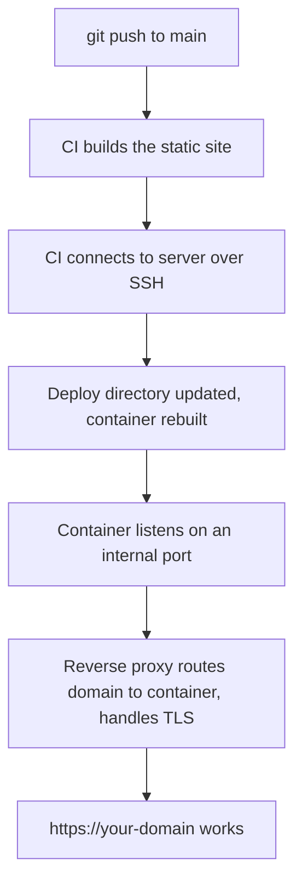

# Deploying a Static Site

Pulls together everything else in this section into one concrete path: a static site (Docusaurus,
Astro, anything that builds to plain HTML/CSS/JS) from a git push to a working `https://` domain.

## The full chain



Every arrow here corresponds to a page already covered:
[SSH Basics](../02-ssh/ssh-basics.md) (C), [Pointing a Domain at a Server](../03-domains-and-dns/pointing-a-domain-at-a-server.md)
(F/G), [Reverse Proxies](../04-web-serving/reverse-proxies.md) and
[TLS & HTTPS](../04-web-serving/tls-https.md) (F).

## How this actually runs for this site

1. Push to `main` → GitHub Actions workflow triggers (see
   [`/internal-operations/git-workflow`](/internal-operations/git-workflow)).
2. The workflow SSHes into the VPS using a dedicated deploy key (`vectorly_docs_key`, via the
   `github-docs` SSH config alias — see [SSH Config](../02-ssh/ssh-config.md)).
3. `docker compose up -d --build` rebuilds and restarts the `docs-app` container in
   `/opt/vectorly-docs`.
4. `docs-app` listens on port 80 **internally only** — not exposed to the internet directly.
5. Caddy, already running and attached to the same Docker network (`proxy-net`), matches incoming
   requests for `docs.vectorly-slovakia.sk` and reverse-proxies them to `docs-app:80`, handling
   TLS termination itself.

See [`/internal-operations/server-architecture`](/internal-operations/server-architecture) for the
exact container names, Caddy config, and SSH key setup this describes in general terms.

## Why the app itself never touches ports 80/443 directly

Only Caddy is exposed to the internet. Every other container sits on the internal
`proxy-net` bridge network, reachable by Caddy but not directly by the outside world — one thing
to keep patched and secured against direct exposure, instead of every app individually.

## Debugging a broken deploy

Work backwards through the chain rather than guessing:

```bash
ssh docs-server "docker ps"                       # 1. is the container even running?
ssh docs-server "docker logs docs-app"              # 2. did it crash / error on startup?
ssh docs-server "curl -sI http://localhost:80"       # 3. is it actually listening internally?
curl -sI https://docs.vectorly-slovakia.sk            # 4. does the full public chain work?
```

If (3) works but (4) doesn't, the problem is in Caddy/DNS/TLS, not the app —
[Troubleshooting Connectivity](./troubleshooting-connectivity.md) has more of this approach.
